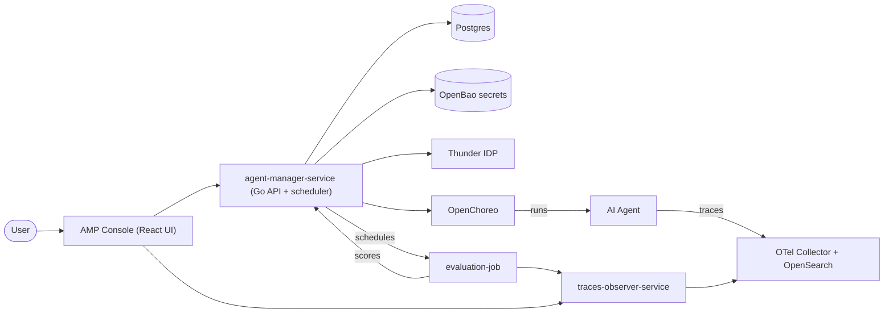
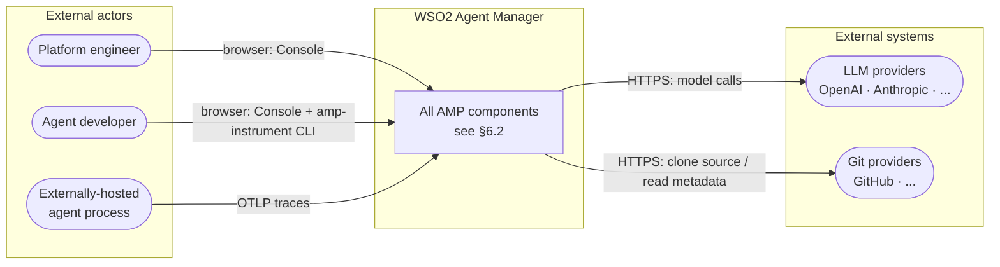
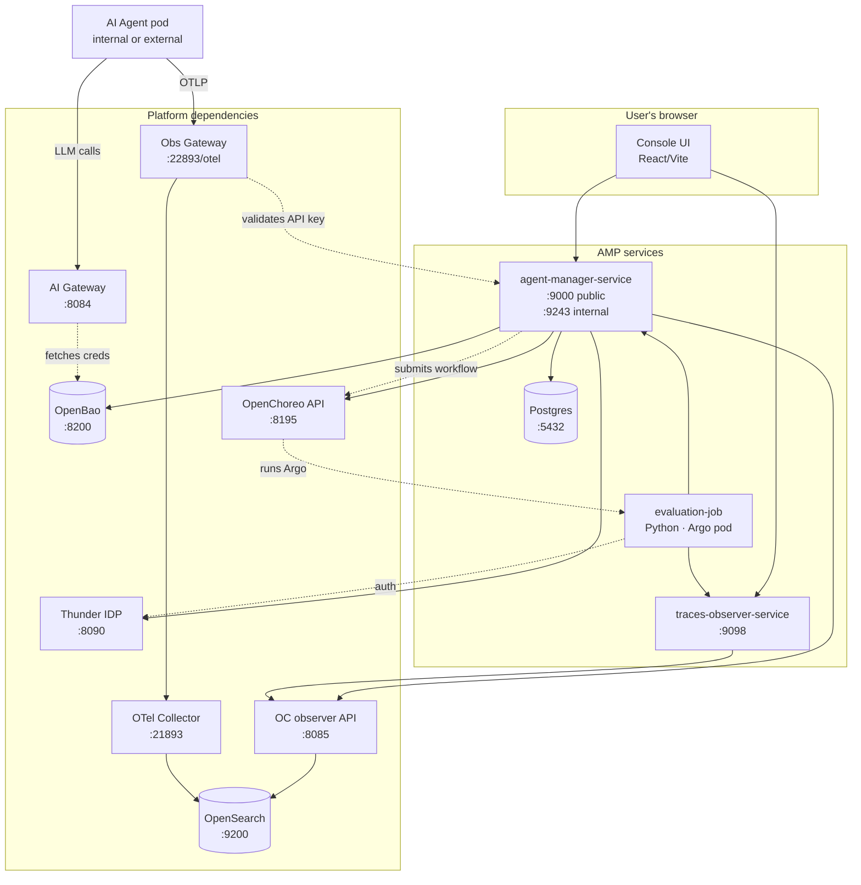
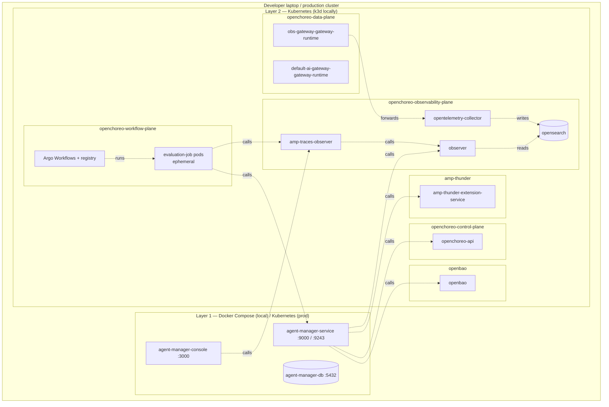
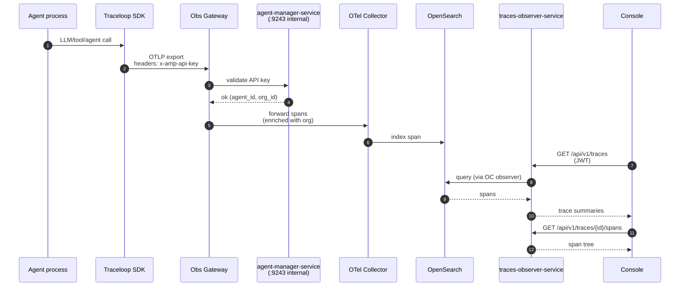
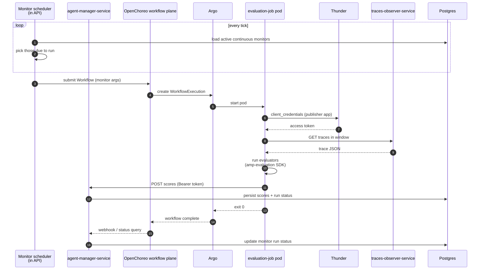
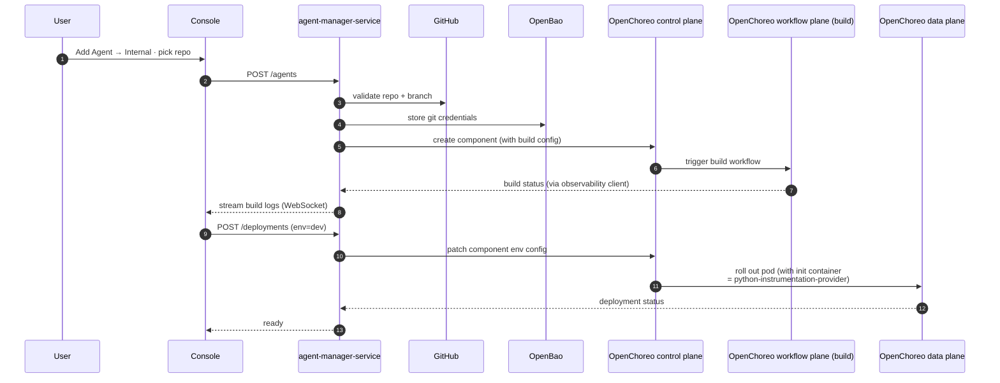
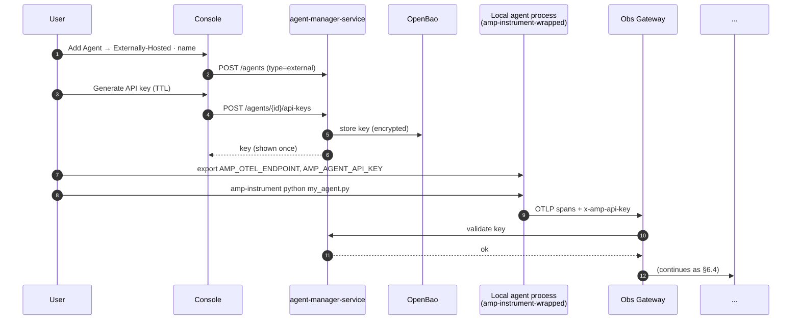

# Architecture

A beginner-oriented walkthrough of how WSO2 Agent Manager (AMP) is put together: which components exist, what each one does, how they talk to each other, and where everything runs. By the end of this page you should be able to open any directory in this repo and have a sense of where it fits.

This is intentionally long. Skim the section titles, then dive into whichever part you need. Diagrams are rendered inline (Mermaid) — if a box or arrow is unclear, the prose underneath each diagram explains it.

---

## 1. What is Agent Manager, in one paragraph

Agent Manager is a **control plane for AI agents**. You point it at AI agents — either ones you deploy through it (it builds them from a Git repo and runs them on Kubernetes) or ones running somewhere else (your laptop, another cloud) — and it gives you one place to **deploy**, **observe**, **govern**, and **evaluate** them. Under the hood it leans on three open-source projects: **OpenChoreo** (Kubernetes-native build/deploy), **Thunder** (identity provider), and **OpenBao** (secret store). On top of that it adds its own services for the AMP-specific concepts: agents, monitors, evaluators, LLM proxies, and gateways.

---

## 2. The 30-second mental model



Five things to keep in your head:

1. **The Console is just a UI.** All real work is done by `agent-manager-service` (the Go API).
2. **`agent-manager-service` does not run agents itself.** It delegates that to OpenChoreo.
3. **Traces are the source of truth for everything observability- and evaluation-related.** Agents emit OpenTelemetry traces, those land in OpenSearch, and every read goes through `traces-observer-service`.
4. **Evaluation runs out-of-band.** A scheduler in the API spawns Argo workflow jobs (`evaluation-job`) on a cron-like cadence. Jobs read traces, run evaluators, and POST scores back to the API.
5. **Secrets and identity live outside Postgres.** Credentials (LLM API keys, Git tokens) are in OpenBao. User and machine identity is in Thunder.

The rest of this document expands every box in that picture.

---

## 3. Glossary — concepts you will see everywhere

These terms appear across code, UI, and database. Skim once now; come back when something is confusing.

| Term | What it is |
|---|---|
| **Organization** | The top-level tenant. Maps 1:1 to an OpenChoreo namespace. |
| **Project** | A grouping of agents inside an organization. Maps to an OpenChoreo project. |
| **Environment** | A logical deployment target inside a project (e.g. `dev`, `prod`). Maps to an OpenChoreo environment. |
| **Agent** | The unit AMP manages. Two flavours: **Internal** (built and deployed by AMP) and **Externally-Hosted** (lives elsewhere, only sends traces in). |
| **Component** (OpenChoreo term) | The deployable artifact behind an internal agent. AMP creates one OpenChoreo component per agent. |
| **Deployment** | A specific running version of an internal agent in a specific environment. |
| **Monitor** | A scheduled evaluation job. Runs one or more evaluators against traces in a time window. Continuous (cron-style) or Historical (one-shot). |
| **Evaluator** | A scoring function. Either rule-based (deterministic) or LLM-as-judge (subjective). 24 built-in + user-defined custom evaluators. |
| **Score** | The output of one evaluator on one trace/agent-execution/LLM-call. Always 0.0 → 1.0. |
| **Trace / Span** | OpenTelemetry concepts. A trace is a tree of spans capturing one agent execution. |
| **AI Gateway** | The runtime egress point for LLM calls from agents. Provides auth, rate-limiting, observability for LLM traffic. Lives in the OpenChoreo data plane. |
| **LLM Provider** | A configured upstream LLM (OpenAI, Anthropic, etc.) — credentials + model list. |
| **LLM Proxy** | An AMP-managed virtual endpoint that fronts one or more LLM providers, applies policies, and exposes a unified API key. |
| **Publisher** | A Thunder OAuth2 application AMP creates per-organization to authorize evaluation jobs and other automated processes when they call back into the AMP API. |

---

## 4. The components — what's in this repo

Every top-level directory at the repo root corresponds to one component or one supporting concern. This section gives you the "what is this folder" answer for each.

### 4.1 `agent-manager-service/` — the Go API and core control plane

The single biggest component. Everything else either calls it or is called by it.

| Aspect | Detail |
|---|---|
| **Language** | Go |
| **Entry point** | `main.go` → `app/app.go` (`Run`) |
| **Deployed as** | Docker image, runs in Compose locally and as a Helm-deployed pod in production |
| **Listens on** | `:9000` (public HTTP API), `:9243` (internal HTTPS — gateway-internal endpoints + WebSocket) |
| **Persistence** | Postgres (`agentmanager` DB) |

#### Internal layout

```
agent-manager-service/
├── main.go                ← thin entry: parses flags, picks auth+secret providers
├── app/                   ← shared Run() that wires logger, DB, scheduler, servers
├── api/                   ← HTTP route registration (one file per resource)
├── controllers/           ← HTTP handlers (request → service)
├── services/              ← business logic (the real work)
├── repositories/          ← DB persistence layer
├── models/                ← request/response DTOs
├── data/, db/, db_migrations/  ← Postgres connection + GORM migrations (numbered)
├── clients/               ← outbound clients to other services (see below)
├── wiring/                ← dependency injection (Wire) — wire.go + wire_gen.go
├── middleware/            ← auth, CORS, logging, rate-limit
├── server/                ← internal HTTPS server (mTLS-ish)
├── websocket/             ← real-time push to console + agents
├── catalog/, resources/   ← built-in LLM provider templates, eval definitions
├── config/                ← env-var driven config struct
└── tests/                 ← integration tests
```

#### Outbound clients (`clients/`)

These are the only places `agent-manager-service` reaches outside its own boundary. If you're tracing a flow, follow them:

| Client | What AMP API uses it for |
|---|---|
| `openchoreosvc/` | Create/update/delete OpenChoreo namespaces, projects, components, builds, deployments, secret references. The bulk of agent lifecycle traffic. |
| `observabilitysvc/` | Pulls metrics and build/runtime logs out of OpenChoreo's observability plane. |
| `thundersvc/` | Creates/rotates per-org "publisher" OAuth2 apps so automated workflows (evaluation jobs) can call back. |
| `secretmanagersvc/` | Read/write secrets in OpenBao. Pluggable: `providers/openbao` is the only OSS impl. |
| `gitprovider/` | Read repo metadata (currently `github`). Used when an internal agent points at a Git source. |

#### Two HTTP servers, on purpose

`app.go` starts **two** servers:

- **Main server** (`:9000`, plain HTTP) — what the Console and external API consumers hit. JWT-authenticated.
- **Internal server** (`:9243`, HTTPS) — for things only OpenChoreo / cluster-side workloads should reach: the gateway-internal API (verifying agent API keys at request time) and the WebSocket endpoint that agents use to subscribe to config changes.

The split exists so you can firewall the two surfaces differently.

#### The monitor scheduler

`services/monitor_scheduler.go` is a long-lived goroutine started in `app.Run`. It polls active continuous monitors and, when one is due, submits an Argo `WorkflowTemplate` execution into the OpenChoreo workflow plane. That workflow runs the `evaluation-job` Python script. See [§6.5](#65-evaluation-flow) for the full sequence.

### 4.2 `console/` — the React management UI

| Aspect | Detail |
|---|---|
| **Stack** | React + Vite, written in TypeScript |
| **Monorepo tool** | Rush + pnpm |
| **Deployed as** | Static assets behind Nginx (`nginx.conf` in this folder) |
| **Listens on** | `:3000` |
| **Talks to** | `agent-manager-service` (`:9000`) and `traces-observer-service` (`:9098`) — both via the user's browser, not server-to-server |

Layout:

```
console/
├── apps/web-ui            ← the Vite app shell
└── workspaces/
    ├── core-ui            ← reusable component library + design system
    ├── libs               ← shared utilities, API clients, types
    └── pages/             ← one folder per top-level UI feature:
        add-new-agent, add-new-project, build, configure-agent,
        deploy, eval, gateways, llm-providers, logs, metrics,
        overview, test, traces
```

The Console **never bypasses the API**. Even the trace viewer pulls trace data through `traces-observer-service` rather than hitting OpenSearch directly. This is what makes per-agent authorization enforceable.

### 4.3 `traces-observer-service/` — the trace query API

| Aspect | Detail |
|---|---|
| **Language** | Go |
| **Listens on** | `:9098` |
| **Runs in** | the OpenChoreo `openchoreo-observability-plane` namespace |
| **Backend** | OpenSearch (the OpenTelemetry trace index) |

It is a thin, JWT-authenticated read API that fronts OpenSearch. Three concerns:

1. **Authorization** — the Console's JWT is verified before a query is executed, so users only see traces for agents they have access to.
2. **Shape** — OpenSearch returns raw OTel spans; the observer reshapes them into trace summaries, span trees, and per-span detail views (`/api/v1/traces`, `/api/v1/traces/{id}/spans`, `/api/v1/traces/{id}/spans/{spanId}`).
3. **Indirection** — it talks to the OpenChoreo "observer" service (port 8085) rather than OpenSearch directly. That observer is the same component OpenChoreo itself uses for build/runtime logs.

Both the Console (for the trace explorer) and the `evaluation-job` (for fetching traces to evaluate) call this service.

### 4.4 `evaluation-job/` — the per-run evaluation script

| Aspect | Detail |
|---|---|
| **Language** | Python |
| **Entry** | `main.py` |
| **Runs as** | A pod, launched by an Argo `WorkflowTemplate` in the `openchoreo-workflow-plane` namespace |
| **Lifetime** | Seconds to a few minutes — created per monitor run, dies when done |

For each scheduled monitor run, `agent-manager-service` submits a workflow with arguments: monitor id, agent id, environment id, evaluator definitions (JSON), trace time window, and the traces-observer endpoint. The pod:

1. Authenticates to Thunder using the per-org publisher client credentials.
2. Calls `traces-observer-service` to fetch traces in the given window.
3. Imports `amp-evaluation` (from `libs/amp-evaluation`) and invokes the configured evaluators.
4. POSTs scores back to `agent-manager-service` (`/monitors/{id}/runs/{runId}/scores` or similar publisher endpoints).

It deliberately holds **no persistent state**. If a run is lost mid-flight, the scheduler creates another.

### 4.5 `python-instrumentation-provider/` — the auto-instrumentation init container

| Aspect | Detail |
|---|---|
| **Language** | Python |
| **Deployed as** | A Kubernetes **init container** image |
| **Configured by** | OpenChoreo, via the AMP build extension, when an internal Python agent is built |

It does exactly two things at agent pod startup:

1. `setup-instrumentation.py` copies a `sitecustomize.py` into the agent container's site-packages.
2. That `sitecustomize.py` (which Python imports automatically before user code) initialises **Traceloop** with two env vars: `AMP_OTEL_ENDPOINT` and `AMP_AGENT_API_KEY`.

The result: any Python agent deployed through AMP gets Traceloop's broad framework instrumentation (OpenAI, Anthropic, LangChain, LlamaIndex, CrewAI, vector stores, MCP) **with zero code changes**.

Externally-hosted agents use the same Traceloop layer, but pulled from the `amp-instrumentation` package via a CLI wrapper (`amp-instrument`).

Since the 2026 instrumentation-versioning redesign, AMP builds **one pre-built image per `(AMP-instrumentation version × Python version)`** — each pinning a specific `traceloop-sdk` — instead of a single image with a ranged SDK. The customer picks an AMP-instrumentation version on the Console create-agent form (persisted on `agent_configs.instrumentation_version`); `agent-manager-service` resolves it to the matching image tag. The build matrix lives in `.github/release-config.json`. Agents on a framework Traceloop doesn't cover can instead use the **manual path** — emit their own OpenTelemetry GenAI spans against a published contract. See [`INSTRUMENTATION.md`](./INSTRUMENTATION.md) §10 for the full versioning model and the manual path.

### 4.6 `libs/` — shared packages (mostly Python)

```
libs/
├── amp-instrumentation   ← Python package. Provides the `amp-instrument` CLI
│                            for wrapping external agents (same Traceloop init
│                            as the init container, installed via pip), plus
│                            `init_otel()` — the exporter helper for the manual
│                            instrumentation path. Pins an exact traceloop-sdk.
└── amp-evaluation        ← Python SDK. Defines the Trace / AgentTrace / LLMSpan
                             data models, the EvalResult contract, the 24 built-in
                             evaluators, and the Monitor runner. Imported by
                             evaluation-job/main.py.
```

Both are published as standalone PyPI packages so users can write custom evaluators (using `amp-evaluation`) or instrument agents (using `amp-instrumentation`) without depending on the rest of the platform.

### 4.7 `deployments/` — how AMP is installed

| Subfolder | Purpose |
|---|---|
| `docker-compose.yml` | Local dev: brings up Console + API + Postgres on the host. |
| `helm-charts/` | Production install — see §5.2. |
| `k8s/`, `single-cluster/`, `quick-start/` | Reference manifests and one-click installers. |
| `values/` | Helm values overlays for different scenarios. |
| `scripts/` | Setup orchestration (`setup.sh`, prerequisites, JWT key generation). |
| `LOCAL_DEV_GUIDE.md` | The most useful single file for first-time contributors. |

### 4.8 `documentation/` — this site

A Docusaurus 3 site. The page you are reading lives at `documentation/docs/overview/architecture.mdx`. Versioned docs in `versioned_docs/`.

### 4.9 Other folders

- `samples/` — example agents you can deploy as a sanity check.
- `local-scripts/` — convenience wrappers around `kubectl` / `docker compose`.
- `.make/`, `Makefile` — every common operation has a make target. Skim the root Makefile.

---

## 5. The platform underneath — what AMP depends on

Everything in §4 is what *this repo* ships. It only works because a stack of supporting platforms runs alongside it. None of these are written or owned by AMP — they are deployed via Helm and consumed.

### 5.1 OpenChoreo

[OpenChoreo](https://github.com/openchoreo/openchoreo) is the heaviest dependency. It is a Kubernetes-native build/deploy/runtime platform, with four logical "planes" each living in its own namespace:

| Plane | Namespace (local) | What it provides AMP |
|---|---|---|
| Control | `openchoreo-control-plane` | The OpenChoreo API (`:8195`). All AMP create/update/delete of agents goes here. |
| Workflow | `openchoreo-workflow-plane` | Argo Workflows + a registry. Builds (`amp-build-extension`) and evaluation runs both execute here. |
| Data | `openchoreo-data-plane` | Gateways: the **AI Gateway** (LLM egress) and the **Obs Gateway** (OTLP ingest from external agents). |
| Observability | `openchoreo-observability-plane` | OpenSearch (trace store), OTel Collector, the OpenChoreo `observer` API, and the AMP `traces-observer`. |

AMP installs OpenChoreo extensions (Helm sub-charts in `deployments/helm-charts/`) that teach it how to build/run AMP-style agents and how to route AMP traces.

### 5.2 Helm charts

Five charts ship from this repo:

| Chart | What it deploys |
|---|---|
| `wso2-agent-manager` | The four AMP services: API, Console, traces-observer, Postgres. |
| `wso2-amp-platform-resources-extension` | Build workflows + platform resources for OpenChoreo (so OC knows how to build AMP agents). |
| `wso2-amp-observability-extension` | Obs Gateway, OTel Collector config, OpenSearch index templates, traces-observer wiring. |
| `wso2-amp-evaluation-extension` | Argo `ClusterWorkflowTemplate` for `evaluation-job`, RBAC, image. |
| `wso2-amp-thunder-extension` | Thunder IDP + the AMP-specific OAuth2 apps Thunder needs. |
| `wso2-amp-ai-gateway-extension` | AI Gateway runtime config (auth, rate-limits, LLM egress routing). |

### 5.3 Thunder — identity

WSO2 Thunder is the IDP. It does three jobs:

1. Authenticates **users** logging into the Console (OIDC).
2. Issues **client credentials** for AMP itself to call OpenChoreo (the `authProvider` injected in `main.go`).
3. Issues **publisher OAuth2 apps** — one per organization — that automated jobs (notably `evaluation-job`) use to authenticate when they call back into `agent-manager-service`. `services/publisher_credential_provisioner.go` provisions these on demand; secrets are stored encrypted in Postgres.

### 5.4 OpenBao — secrets

OpenBao is an open-source Vault fork. It stores everything that should not be in Postgres:

- LLM provider API keys (when the user provides one)
- Git provider PATs
- Per-agent API keys (which Traceloop sends as `x-amp-api-key`)
- Anything the LLM proxy needs at runtime

The `clients/secretmanagersvc/providers/openbao` provider is the OSS implementation. The Provider interface is pluggable so cloud deployments can swap in another backend.

### 5.5 OpenSearch + OTel Collector

The trace pipeline:

```
Agent (Traceloop) ──OTLP──▶ Obs Gateway ──▶ OTel Collector ──▶ OpenSearch
                            (data plane)    (obs plane)        (obs plane)
```

The Obs Gateway is the *only* externally-reachable OTLP endpoint. It validates the `x-amp-api-key` header against `agent-manager-service`'s **internal** API (the `:9243` HTTPS server) before forwarding spans. That is why the API has two HTTP servers — see §4.1.

### 5.6 cert-manager, External Secrets, Kgateway, Argo

Infrastructure-level dependencies AMP installs but does not interact with directly:

- **cert-manager** — issues certificates for the gateways and internal mTLS.
- **External Secrets Operator** — syncs secrets from OpenBao into Kubernetes Secrets at runtime.
- **Kgateway** — implements Gateway API for the data-plane gateways.
- **Argo Workflows** — the engine `evaluation-job` runs on. Builds also use it.

---

## 6. The diagrams

Each diagram in this section is paired with prose. Read both.

### 6.1 Context diagram — who uses AMP and what AMP uses



Two things to notice:

- AMP is the **boundary**. Externally-hosted agents do not call LLMs through AMP unless you point them at the AMP AI Gateway; they only send traces in.
- All outbound calls to LLM providers go through the **AI Gateway** (data plane), never directly from `agent-manager-service`.

### 6.2 Container diagram — every AMP-owned process



Things worth highlighting:

- **The dotted arrow `OBSGW -. validates API key .-> API`** is why `agent-manager-service` runs an internal HTTPS server. The Obs Gateway calls `:9243` to verify each incoming agent token before accepting traces.
- **`EJ → API` and `EJ → TO`** — the evaluation job calls *both* the API (to publish scores) and the trace observer (to fetch traces). It uses Thunder-issued publisher credentials for the API call.
- **No process talks to OpenSearch directly** except the observer chain. OpenSearch is never on the user-facing path.

### 6.3 Deployment view — where things actually run

This is the local-dev split from `LOCAL_DEV_GUIDE.md`. Production looks similar except everything runs in Kubernetes (no Compose layer).



Local dev uses Compose for AMP's own services because rebuilding the API or Console image into a k3d cluster on every code change is slow. In production it's all Helm-installed Kubernetes; the namespaces are the same.

### 6.4 Trace flow — how a span gets from agent to dashboard



Key invariants:

- An agent without a valid `x-amp-api-key` is **rejected at the gateway**, before its spans ever reach OpenSearch.
- Traces are stamped with `org_id` and `agent_id` at ingest, so the observer's per-user filtering is trivial — the JWT carries an org and that becomes the OpenSearch query filter.
- Internal agents and external agents go through the **same** ingest path. From OpenSearch's perspective there is no difference.

### 6.5 Evaluation flow



Why split the work this way?

- Evaluation can be expensive (LLM-as-judge calls real models). Putting it in a separate pod means it does not contend for resources with the API server.
- A failed evaluation pod cannot corrupt API state — it just exits non-zero, and the scheduler picks up the failure on the next status query.
- New evaluator versions can be rolled out by bumping the `evaluation-job` image without redeploying the API.

### 6.6 Internal-agent deploy flow



The init container injection at step 11 is what makes deployed agents auto-instrumented. The build extension shipped in `wso2-amp-platform-resources-extension` teaches OpenChoreo to attach this init container to any AMP-built component.

### 6.7 External-agent onboarding



The same `x-amp-api-key` mechanism is used for the init container in internal agents — internal agents just have the key wired in automatically by the deployment flow.

---

## 7. Data stores

### 7.1 Postgres (`agentmanager`)

The relational backbone. Migrations live in `agent-manager-service/db_migrations/` as numbered Go files (each calls into GORM). A condensed map of what's there:

| Domain | Tables (representative) | Where to look in code |
|---|---|---|
| Tenancy | `organizations`, `projects` | `migrations/*` |
| Agents | `agents`, `internal_agents`, `agent_configs`, `agent_configurations`, `agent_env_config_variables` | `repositories/agent_*.go` |
| Auth | `api_keys`, `org_publisher_credentials` | `migrations/011_*`, `012_*`, `014_*` |
| LLM stack | `llm_providers`, `llm_proxies`, `llm_proxy_*`, `llm_provider_templates` | `repositories/llm_*.go` |
| Gateways | `gateways`, `artifacts`, `apis` | `migrations/002_*`, `003_*`, `009_*` |
| Evaluation | `monitors`, `custom_evaluators`, `evaluation_scores`, `monitor_llm_mappings` | `migrations/005_*`, `006_*`, `010_*`, `013_*` |

A live ER diagram is rendered in `agent-manager-service/docs/database-er.md`. Treat that file as the source of truth for the schema; this section is just a wayfinding map.

### 7.2 OpenSearch

Backs all trace and span data. Index templates and ILM policies are deployed via `wso2-amp-observability-extension`. AMP code never queries OpenSearch directly — always through the OpenChoreo `observer` service, which `traces-observer-service` wraps.

### 7.3 OpenBao

KV secrets. Path layout (rough):

```
secret/
  organizations/{org-name}/
    git/{provider}/{credential-id}
    llm-providers/{provider-id}/api-key
    llm-proxies/{proxy-id}/api-key
  agents/{agent-id}/api-keys/{key-id}
```

The exact paths are owned by `clients/secretmanagersvc/types.go` (`SecretLocation`). Read that file when in doubt.

---

## 8. Authentication & authorization

Three distinct identity flows. Don't confuse them.

### 8.1 User → Console → API

1. User logs into the Console via Thunder (OIDC).
2. Console gets a JWT.
3. Every API call carries `Authorization: Bearer <jwt>`.
4. `agent-manager-service` middleware verifies the signature using JWT keys generated at install time (`deployments/scripts` writes them into `agent-manager-service/keys/`).
5. Claims (org id, user id, roles) are placed in request context.

### 8.2 AMP API → OpenChoreo

1. At startup `main.go` builds an `ocauth.AuthProvider` with Thunder client credentials.
2. The OpenChoreo client uses it to fetch and cache an access token.
3. Token is attached to every outbound OpenChoreo call.

### 8.3 Agent → Obs Gateway (and Workflow → AMP API)

1. **Agents** present `x-amp-api-key`. The Obs Gateway calls the AMP **internal** API to validate; key metadata maps to `agent_id` and `org_id`.
2. **Evaluation jobs** present a Bearer token issued by Thunder for the per-org "publisher" app. The publisher's client id/secret is provisioned on demand by `services/publisher_credential_provisioner.go` and stored encrypted in Postgres (column-level encryption).

The reason these are separate: agent API keys need to be cheap to validate at high QPS (every span), while publisher tokens are short-lived OAuth2 access tokens issued infrequently per workflow run.

---

## 9. Repository layout — quick map

| Path | What lives here |
|---|---|
| `agent-manager-service/` | Go API + monitor scheduler. The control plane brain. |
| `console/` | React/Vite UI. Rush monorepo. |
| `traces-observer-service/` | Go service: trace query API. |
| `evaluation-job/` | Python entry script for monitor runs. |
| `python-instrumentation-provider/` | Init container source (Python). |
| `libs/amp-instrumentation/` | PyPI package: `amp-instrument` CLI for external agents. |
| `libs/amp-evaluation/` | PyPI package: evaluator SDK + built-ins. |
| `samples/` | Reference agents you can deploy as a smoke test. |
| `deployments/` | Compose, Helm, k8s manifests, install scripts. |
| `documentation/` | This Docusaurus site. |
| `local-scripts/` | Convenience shell wrappers. |
| `Makefile`, `.make/` | Top-level build/dev orchestration. Skim these. |

---

## 10. Where to look next

If you want to… | Read this
---|---
…run AMP locally | [`./LOCAL_DEV_GUIDE.md`](./LOCAL_DEV_GUIDE.md)
…understand the database | `agent-manager-service/docs/database-er.md`
…see the public API | `agent-manager-service/docs/api_v1_openapi.yaml`
…understand evaluators | [Evaluation concepts](../documentation/docs/concepts/evaluation.mdx) and `libs/amp-evaluation/CONCEPTS.md`
…understand traces | [Observability concepts](../documentation/docs/concepts/observability.mdx)
…follow a request through the API | `agent-manager-service/api/*_routes.go` → `controllers/` → `services/` → `repositories/`
…follow an outbound call | `agent-manager-service/clients/{openchoreosvc,thundersvc,observabilitysvc,secretmanagersvc,gitprovider}/`
…see what gets installed | `deployments/helm-charts/`
…see how an agent is auto-instrumented | `python-instrumentation-provider/sitecustomize.py`

If something in this document is wrong or stale, fix it here — `references/ARCHITECTURE.md` — rather than letting the next reader stumble over the same thing.
