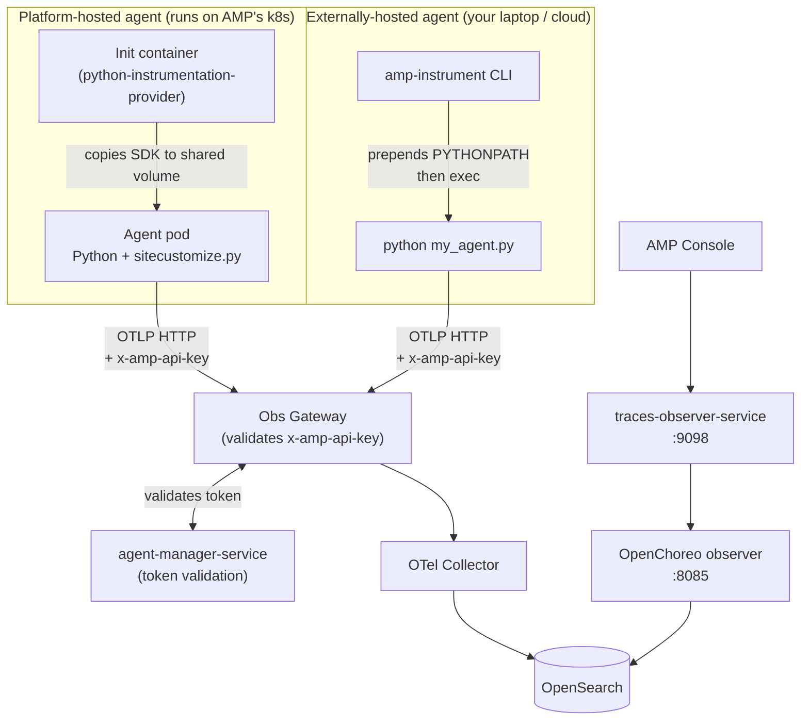
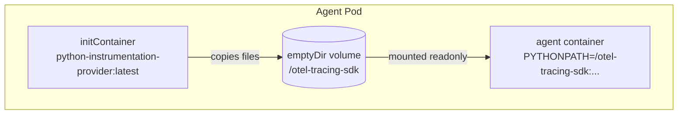
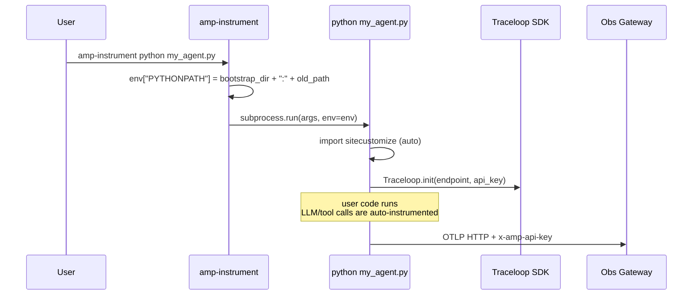
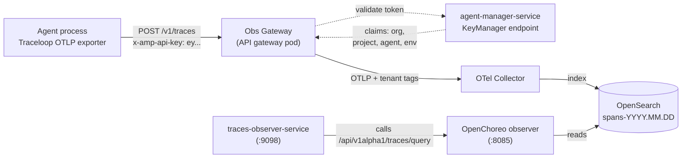
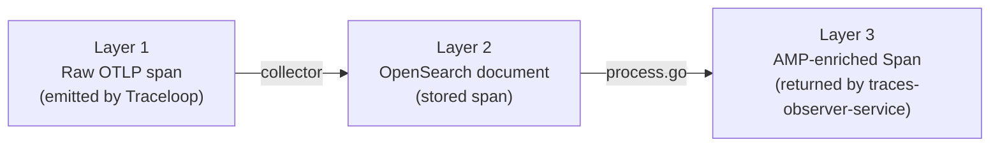
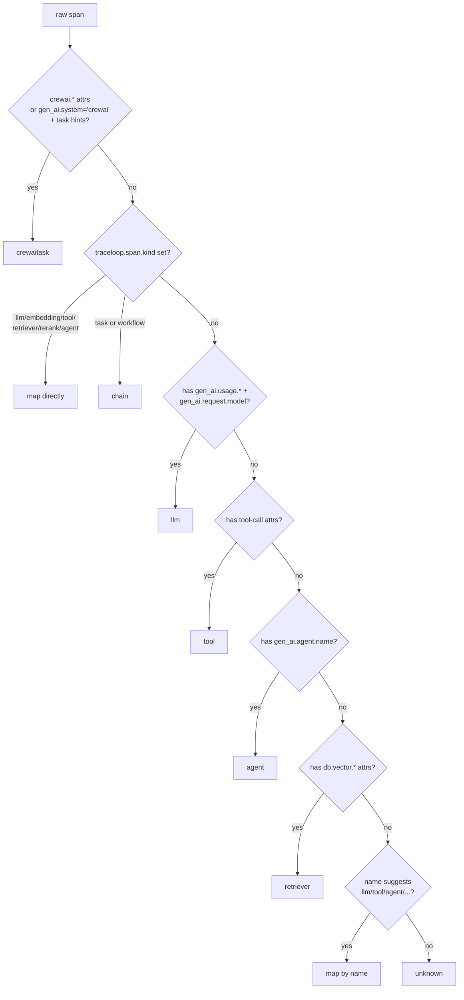

# Instrumentation Internals

A beginner-oriented deep dive into how AMP collects telemetry from AI agents: how the SDK gets into the agent process, what data shape each span ends up in, and every hop a span takes from "the agent called OpenAI" to "the user opens the trace in Console."

This is the companion to [`ARCHITECTURE.md`](./ARCHITECTURE.md). Architecture explains *what* the components are; this document explains *how telemetry flows through them*.

If you have never worked with OpenTelemetry before: a **span** is a single timed operation (e.g., one LLM call), a **trace** is the tree of spans for one request, and **OTLP** is the wire protocol agents use to ship spans to a backend. That is enough background to read on.

---

## 1. The big picture in one diagram

AMP supports two ways to run an agent. Both end up emitting telemetry through the **same backend pipeline**. The only thing that differs is *how the OpenTelemetry SDK gets loaded into the agent process*.



**Key insight:** the agent never knows whether it is platform-hosted or external. Both cases boil down to: "Python loaded an SDK that auto-instruments LLM/tool calls and ships OTLP to an endpoint with an API key header." The two delivery mechanisms exist because the *bootstrapping problem* is different — on Kubernetes we can mount files into the container; on a laptop we cannot.

> **Two axes, not one.** *Where* an agent runs (platform-hosted / externally-hosted) is independent of *how* it's instrumented (**auto** — Traceloop monkey-patches the agent, zero code; or **manual** — the agent emits its own OpenTelemetry GenAI spans against a published contract). Sections 3–4 cover the two auto delivery mechanisms; §10 covers the manual path and the instrumentation-versioning model that the 2026 redesign introduced. If you're reading this to understand the redesign, **start at §10.**

---

## 2. What does "instrumented" mean here?

The instrumentation library is [**Traceloop / OpenLLMetry**](https://github.com/traceloop/openllmetry) (`traceloop-sdk`). When `Traceloop.init(...)` runs, it:

1. **Monkey-patches** popular AI libraries (OpenAI client, Anthropic client, LangChain, LlamaIndex, CrewAI, vector stores like Chroma/Pinecone, etc.) so that every method call automatically opens a span, records inputs/outputs/tokens, and closes the span.
2. **Configures an OTLP exporter** that batches spans and POSTs them as protobuf to the configured endpoint over HTTP.
3. **Adds resource attributes** that travel on every span (the agent version, etc.).

The result: your agent code is unchanged, but every LLM call, every tool call, every retrieval becomes a span with rich metadata. The semantic conventions used follow the **OpenTelemetry GenAI** spec (attributes prefixed `gen_ai.*`) plus a few Traceloop-specific attributes (`traceloop.span.kind`, `traceloop.entity.input/output`).

> **Why Traceloop and not vanilla OpenTelemetry?** Vanilla OTel's GenAI conventions are still maturing, and getting per-framework instrumentations stable is hard. Traceloop bundles ~30 instrumentations against a coherent attribute schema, which is what the rest of AMP (the observer, the evaluators, the Console UI) is written against.

---

## 3. Platform-hosted agents — init container injection

Source: [`python-instrumentation-provider/`](../python-instrumentation-provider/)

### 3.1 The bootstrap problem

When AMP builds and deploys an agent, it does **not** want to require the user's `requirements.txt` to include `traceloop-sdk`, and it does **not** want to require the user to call any init function in their code. The agent should ship telemetry **with zero code changes**.

The trick: Python automatically imports a module called `sitecustomize` at interpreter startup if one exists on `sys.path`. So if AMP can place a `sitecustomize.py` (and the `traceloop-sdk` it depends on) on the agent's `PYTHONPATH` before the agent process starts, instrumentation initializes itself before any user code runs.

### 3.2 The injection mechanism



Three files do all the work:

**`Dockerfile`** — multi-stage build. Stage 1 installs `traceloop-sdk` into a `packages/` directory and drops `sitecustomize.py` next to it. Stage 2 is a thin Python image whose `CMD` runs the copy script.

**`setup-instrumentation.py`** — runs as the init container's main process. It copies `/instrumentations/otel-tracing/*` (the bundled SDK + `sitecustomize.py`) into `/otel-tracing-sdk/`, which is the shared `emptyDir` volume mounted into the main container.

**`sitecustomize.py`** — the autoloaded entry point in the main container:

```python
from traceloop.sdk import Traceloop

otel_endpoint  = os.getenv("AMP_OTEL_ENDPOINT")
api_key        = os.getenv("AMP_AGENT_API_KEY")
trace_content  = os.getenv("AMP_TRACE_CONTENT", "true")

os.environ["TRACELOOP_TRACE_CONTENT"]   = trace_content
os.environ["TRACELOOP_METRICS_ENABLED"] = "false"

Traceloop.init(
    telemetry_enabled=False,            # disable Traceloop's own analytics
    api_endpoint=otel_endpoint,
    headers={"x-amp-api-key": api_key},
)
```

### 3.3 Where the env vars come from

The agent container needs `AMP_OTEL_ENDPOINT` and `AMP_AGENT_API_KEY`. AMP sets them via OpenChoreo's "env injection trait" attached at deployment time:

- **`AMP_OTEL_ENDPOINT`** — the cluster-internal Obs Gateway URL.
- **`AMP_AGENT_API_KEY`** — a JWT minted by `agent-manager-service` containing claims `org`, `project`, `agent`, `environment`. TTL is one year.

Implementation: [`agent-manager-service/services/agent_manager.go`](../agent-manager-service/services/agent_manager.go) — see `attachEnvInjectionTrait` and `generateAgentAPIKey`. The persisted instrumentation toggle lives in the `agent_configs` table (one row per agent + environment).

> **Why a per-agent JWT and not a shared API key?** The Obs Gateway uses the JWT's claims to **tag every span** with `org`, `project`, `agent`, `environment`. That is what makes multi-tenant trace storage safe — a tenant can never read another tenant's spans because the indexing happens at ingest time, not query time.

---

## 4. Externally-hosted agents — CLI wrapper

Source: [`libs/amp-instrumentation/`](../libs/amp-instrumentation/)

### 4.1 The same problem in a different environment

On a laptop or third-party VM there is no init container and no Kubernetes env-injection trait. The user runs `python my_agent.py` themselves. We still need `sitecustomize.py` to load before the agent's code, and the user must not have to edit their script.

The trick: install a CLI tool (`amp-instrument`) that accepts the user's command, **prepends a bootstrap directory to `PYTHONPATH`**, and `exec`s the command. The bootstrap directory contains a `sitecustomize.py` that initializes Traceloop the same way the platform-hosted version does.

### 4.2 Anatomy of the package

```
libs/amp-instrumentation/
└── src/amp_instrumentation/
    ├── _bootstrap/
    │   ├── sitecustomize.py     ← auto-imported by the wrapped Python
    │   ├── initialization.py    ← Traceloop.init() logic
    │   └── constants.py         ← env var names
    └── cli/
        └── main.py              ← `amp-instrument` entry point
```

### 4.3 The CLI flow



Required env vars (from [`_bootstrap/constants.py`](../libs/amp-instrumentation/src/amp_instrumentation/_bootstrap/constants.py)):

| Variable | Required | Purpose |
|---|---|---|
| `AMP_OTEL_ENDPOINT` | yes | OTLP HTTP endpoint of the Obs Gateway |
| `AMP_AGENT_API_KEY` | yes | JWT generated by Console for this agent |
| `AMP_TRACE_CONTENT` | no | `"true"` (default) records prompts/completions; `"false"` suppresses them |
| `AMP_AGENT_VERSION` | no | Free-form version string, attached as a resource attribute |
| `AMP_DEBUG` | no | Enables verbose logging from the bootstrap |

The user gets the API key from Console: register agent → "Generate API Key" → copy once (it is stored encrypted in OpenBao after that point). End-user doc: [`documentation/docs/concepts/observability.mdx`](../documentation/docs/concepts/observability.mdx).

### 4.4 Platform-hosted vs externally-hosted at a glance

| Aspect | Platform-hosted | Externally-hosted |
|---|---|---|
| Where it runs | AMP's k8s cluster | User's laptop / cloud |
| SDK delivery | Init container copies into shared volume | `pip install amp-instrumentation` |
| Bootstrap trigger | `sitecustomize.py` on `PYTHONPATH` (set in image) | `sitecustomize.py` via `amp-instrument` CLI prepending `PYTHONPATH` |
| API key injection | Auto, via OpenChoreo env-injection trait | Manual `export AMP_AGENT_API_KEY=...` |
| OTel endpoint | Cluster-internal URL injected by AMP | User exports their tenant's gateway URL |
| Code changes for the user | None | None (just wrap the launch command) |
| **Trace pipeline downstream** | **Identical** | **Identical** |

---

## 5. The ingestion pipeline

Once spans leave the agent, they travel through five hops before showing up in Console.



**Hop 1 — Obs Gateway.** Pod-level NetworkPolicy only accepts traffic from system pods or external sources holding a valid `x-amp-api-key`. The gateway calls back to `agent-manager-service:9243` to validate the JWT, then propagates the tenant claims as headers so the collector can tag spans before indexing.

**Hop 2 — OTel Collector.** Vanilla OpenTelemetry collector with index-by-tenant config. Stores spans into OpenSearch in time-bucketed indices (`spans-YYYY.MM.DD`).

**Hop 3 — OpenChoreo observer (`:8085`).** Read-side service maintained by OpenChoreo. Provides `/api/v1alpha1/traces/query`, `/api/v1alpha1/traces/{id}/spans/query`, `/api/v1alpha1/traces/{id}/spans/{spanId}` over OAuth2.

**Hop 4 — `traces-observer-service` (`:9098`).** AMP-specific Go service. Three responsibilities:

1. **Auth**: JWT middleware validates the caller is allowed to read this tenant's data.
2. **Query orchestration**: forwards to OpenChoreo observer with org/project/agent/environment scoped down.
3. **Enrichment**: takes raw OpenSearch spans and produces AMP-shaped `Span` documents with an `ampAttributes` block — model name, token usage, tool definitions, framework, etc. extracted out of the raw `gen_ai.*` attribute soup.

**Hop 5 — Console / evaluation-job.** Both consume the AMP-shaped responses. Console renders the trace tree; the evaluation job parses traces into evaluation models and runs evaluators.

---

## 6. Telemetry data structures

This is the part most worth understanding. There are **three layers** of representation, each progressively more AMP-specific.



### 6.1 Layer 1 — raw OTLP span

What Traceloop produces. Standard OpenTelemetry shape:

```json
{
  "traceId":      "9f4a...",
  "spanId":       "1c2b...",
  "parentSpanId": "0a8d...",
  "name":         "openai.chat",
  "kind":         "CLIENT",
  "startTimeUnixNano": "...",
  "endTimeUnixNano":   "...",
  "attributes": {
    "gen_ai.system":              "openai",
    "gen_ai.request.model":       "gpt-4o-mini",
    "gen_ai.response.model":      "gpt-4o-mini-2024-07-18",
    "gen_ai.request.temperature": 0.7,
    "gen_ai.prompt.0.role":       "system",
    "gen_ai.prompt.0.content":    "You are a helpful assistant.",
    "gen_ai.prompt.1.role":       "user",
    "gen_ai.prompt.1.content":    "What is the capital of France?",
    "gen_ai.completion.0.role":   "assistant",
    "gen_ai.completion.0.content":"Paris.",
    "gen_ai.usage.input_tokens":  18,
    "gen_ai.usage.output_tokens": 2,
    "traceloop.span.kind":        "llm",
    "traceloop.entity.input":     "...",
    "traceloop.entity.output":    "..."
  },
  "resource": {
    "service.name":                       "<component-uid>",
    "agent-manager/agent-version":        "0.3.1",
    "openchoreo.dev/component-uid":       "..."
  }
}
```

The attribute keys come from the **OpenTelemetry GenAI semantic conventions** plus Traceloop extensions. The keys an AMP engineer needs to recognize:

| Attribute | Meaning |
|---|---|
| `gen_ai.system` | Vendor — `openai`, `anthropic`, `crewai`, ... |
| `gen_ai.request.model` / `gen_ai.response.model` | Model name |
| `gen_ai.request.temperature` | Sampling temperature |
| `gen_ai.prompt.{N}.role` / `gen_ai.prompt.{N}.content` | Indexed prompt messages |
| `gen_ai.completion.{N}.role` / `gen_ai.completion.{N}.content` | Indexed response messages |
| `gen_ai.usage.input_tokens` / `output_tokens` / `cache_read_input_tokens` | Token counters |
| `gen_ai.agent.name` / `gen_ai.agent.tools` | Agent metadata |
| `gen_ai.conversation.id` | Conversation correlation |
| `traceloop.span.kind` | Explicit kind hint: `llm`, `tool`, `embedding`, `retriever`, `rerank`, `agent`, `task`, `workflow` |
| `traceloop.entity.input` / `traceloop.entity.output` | Free-form input/output capture for non-LLM spans |
| `db.system` / `db.vector.query.top_k` | Vector DB retrieval |
| `crewai.*` | CrewAI-specific (task name, crew result, agent max iter, ...) |

### 6.2 Layer 2 — OpenSearch document

Same data, indexed in OpenSearch as `spans-YYYY.MM.DD/<docId>`. Schema is essentially the OTel data model flattened. The collector adds tenant-tagging fields derived from the JWT claims (`organization`, `project`, `component`, `environment`).

### 6.3 Layer 3 — AMP-enriched `Span`

Defined in [`traces-observer-service/opensearch/types.go`](../traces-observer-service/opensearch/types.go). Built by `process.go` from the raw document.

```go
type Span struct {
    TraceID         string
    SpanID          string
    ParentSpanID    string
    Name            string
    Service         string                 // component UID
    StartTime       time.Time
    EndTime         time.Time
    DurationInNanos int64
    Kind            string                 // OTel SpanKind
    Status          string
    Attributes      map[string]interface{} // raw gen_ai.*, traceloop.*, ...
    Resource        map[string]interface{}
    AmpAttributes   *AmpAttributes         // <-- AMP's enrichment
}

type AmpAttributes struct {
    Kind   string      `json:"kind"`   // llm | tool | embedding | retriever |
                                       // rerank | agent | chain | crewaitask | unknown
    Input  interface{} `json:"input"`  // typed per-kind
    Output interface{} `json:"output"`
    Status *SpanStatus `json:"status"`
    Data   interface{} `json:"data"`   // *LLMData | *ToolData | *AgentData | ...
}
```

The point of `AmpAttributes` is to spare every downstream consumer (Console, evaluators) from having to grok the raw OTel attribute namespace. The observer does the parsing once.

### 6.4 The nine span kinds

Defined in `opensearch/types.go`:

| Kind | What it represents | Typical source |
|---|---|---|
| `llm` | A single LLM completion / chat call | OpenAI, Anthropic, Bedrock |
| `embedding` | Embedding generation | `text-embedding-3-small`, etc. |
| `tool` | A tool / function call (incl. MCP) | LangChain Tool, function-calling |
| `retriever` | Vector DB retrieval | Pinecone, Chroma, Weaviate |
| `rerank` | Reranking step | Cohere rerank, etc. |
| `agent` | Agent reasoning / orchestration step | CrewAI Agent, LangChain AgentExecutor |
| `chain` | Generic task / workflow step | LangChain chain, custom workflow |
| `crewaitask` | CrewAI task-level operation | CrewAI Task |
| `unknown` | Could not classify | Anything else |

### 6.5 Per-kind payloads

```go
type LLMData struct {
    Tools       []ToolDefinition
    Model       string
    Vendor      string
    Temperature *float64
    TokenUsage  *LLMTokenUsage
}

type ToolData struct {
    Name string
}

type EmbeddingData struct {
    Model      string
    Vendor     string
    TokenUsage *LLMTokenUsage
}

type RetrieverData struct {
    VectorDB string  // db.system
    TopK     int     // db.vector.query.top_k
}

type AgentData struct {
    Name           string
    Tools          []ToolDefinition
    Model          string
    Framework      string  // gen_ai.system
    SystemPrompt   string
    MaxIter        int     // crewai.agent.max_iter
    TokenUsage     *LLMTokenUsage
    ConversationID string
}

type CrewAITaskData struct {
    Name        string
    Description string
    Tools       []ToolDefinition
}

type LLMTokenUsage struct {
    InputTokens          int
    OutputTokens         int
    CacheReadInputTokens int
    TotalTokens          int
}
```

### 6.6 A real enriched span (illustrative)

The same OTel span from §6.1, after passing through the observer:

```json
{
  "traceId":      "9f4a...",
  "spanId":       "1c2b...",
  "parentSpanId": "0a8d...",
  "name":         "openai.chat",
  "service":      "agent-component-uid",
  "kind":         "CLIENT",
  "status":       "OK",
  "durationInNanos": 412_530_000,

  "attributes": { "gen_ai.system": "openai", "...": "..." },
  "resource":   { "service.name": "agent-component-uid" },

  "ampAttributes": {
    "kind":  "llm",
    "input": [
      { "role": "system", "content": "You are a helpful assistant." },
      { "role": "user",   "content": "What is the capital of France?" }
    ],
    "output": [
      { "role": "assistant", "content": "Paris." }
    ],
    "status": { "error": false },
    "data": {
      "model":       "gpt-4o-mini-2024-07-18",
      "vendor":      "openai",
      "temperature": 0.7,
      "tokenUsage": {
        "inputTokens":  18,
        "outputTokens": 2,
        "totalTokens":  20
      }
    }
  }
}
```

### 6.7 Trace-level aggregations

For trace lists in Console, the observer rolls spans up into:

```go
type TraceOverview struct {
    TraceID         string
    RootSpanID      string
    RootSpanName    string
    RootSpanKind    string
    StartTime       string
    EndTime         string
    DurationInNanos int64
    SpanCount       int
    TokenUsage      *TokenUsage   // summed across all LLM/agent spans
    Status          *TraceStatus  // { errorCount }
    Input           interface{}   // copied from root span's ampAttributes.input
    Output          interface{}
}

type FullTrace struct {
    // everything from TraceOverview, plus:
    TaskId  string  // from W3C baggage (set by evaluation runs)
    TrialId string  // from W3C baggage
    Spans   []Span
}
```

`TaskId` / `TrialId` are pulled from OpenTelemetry **baggage** propagated by the evaluation job — they let the system join a trace back to the evaluation trial that produced it.

---

## 7. How a span's kind is decided

Most of the per-kind enrichment depends on first deciding **which of the nine kinds a raw span is**. The function is `DetermineSpanType` in [`traces-observer-service/opensearch/process.go`](../traces-observer-service/opensearch/process.go). It applies a **priority cascade** — the first rule that matches wins.



After the kind is decided, the observer calls a kind-specific `populateXxxAttributes` function (`populateLLMAttributes`, `populateToolAttributes`, `populateAgentAttributes`, ...) which copies the relevant raw attrs into the typed `Data` struct and the `Input`/`Output` fields.

---

## 8. Multi-tenancy and security

Three properties make tenant isolation work:

1. **Per-agent JWT in `x-amp-api-key`.** Every span ships with a token whose claims hard-bind it to one (org, project, agent, environment).
2. **Validation at the gateway**, not at the collector. The Obs Gateway calls `agent-manager-service` to verify the token, then attaches the tenant claims as request headers. Collectors and storage trust those headers because no other path into them is exposed.
3. **Read-side scoping.** Every query through `traces-observer-service` carries a JWT representing the *human user*. The middleware checks the user belongs to the org being queried before forwarding to OpenChoreo observer with that scope baked into the search request.

A compromised agent token can only ever ship spans belonging to its own tenant, and a compromised user token can only ever read traces from its own org. Neither can cross tenants.

---

## 9. File map

A quick reference of every file referenced in this document.

| Path | Role |
|---|---|
| `python-instrumentation-provider/Dockerfile` | Builds the init container image; `ARG TRACELOOP_VERSION` / `ARG PYTHON_VERSION` parameterize the build |
| `python-instrumentation-provider/setup-instrumentation.py` | Init container's main process — copies SDK to shared volume |
| `python-instrumentation-provider/sitecustomize.py` | Runs at agent Python startup, calls `Traceloop.init` |
| `python-instrumentation-provider/requirements.txt` | Build deps for the init image (`httpx`); `traceloop-sdk` is **not** here — its version comes from `release-config.json` via `ARG TRACELOOP_VERSION` |
| `python-instrumentation-provider/RELEASING.md` | Maintainer runbook for cutting a new AMP-instrumentation version |
| `.github/release-config.json` | Source of truth for the `(AMP-instr version → traceloop-sdk → python set)` image matrix |
| `.github/workflows/python_instrumentation_image_release.yaml` | Standalone workflow to publish per-version init-container images |
| `libs/amp-instrumentation/src/amp_instrumentation/cli/main.py` | `amp-instrument` CLI |
| `libs/amp-instrumentation/src/amp_instrumentation/otel.py` | `init_otel()` — OTLP exporter setup for the manual path |
| `libs/amp-instrumentation/src/amp_instrumentation/_bootstrap/sitecustomize.py` | Auto-imported in wrapped subprocess |
| `libs/amp-instrumentation/src/amp_instrumentation/_bootstrap/initialization.py` | Traceloop init for external case |
| `libs/amp-instrumentation/src/amp_instrumentation/_bootstrap/constants.py` | Env var names |
| `agent-manager-service/services/agent_manager.go` | `attachEnvInjectionTrait`, `generateAgentAPIKey`, `persistInstrumentationConfig` |
| `traces-observer-service/main.go` | HTTP server wiring, route mounting |
| `traces-observer-service/config/config.go` | Config / env var schema |
| `traces-observer-service/observer/client.go` | OpenChoreo observer HTTP client (with token retry) |
| `traces-observer-service/observer/types.go` | Request/response DTOs to OpenChoreo observer |
| `traces-observer-service/opensearch/types.go` | `Span`, `AmpAttributes`, per-kind data structs, `TraceOverview`, `FullTrace` |
| `traces-observer-service/opensearch/process.go` | `DetermineSpanType` + `populateXxxAttributes` |
| `traces-observer-service/opensearch/crewai_process.go` | CrewAI-specific extraction |
| `traces-observer-service/handlers/handlers.go` | HTTP handlers (`GetTraceOverviews`, `GetTraceSpans`, `GetSpanDetail`, `ExportTraces`) |
| `deployments/values/obs-gateway.yaml` | Obs Gateway resource definition |
| `deployments/values/otel-collector-rest-api.yaml` | OTel collector REST API config (JWT issuers, claim mappings) |
| `documentation/docs/concepts/observability.mdx` | End-user onboarding (companion read) |
| `documentation/docs/components/amp-instrumentation.mdx` | End-user `amp-instrument` reference |

---

## 10. Instrumentation versioning and the manual path (2026 redesign)

Everything in §1–§9 describes the mechanism *before* the 2026 instrumentation-versioning redesign. The mechanism didn't change — init container, `sitecustomize.py`, the `amp-instrument` CLI, the OTLP pipeline all stay. What changed is **who controls the SDK version**, and the addition of a **documented manual path**. The approved design is in [`INSTRUMENTATION_REDESIGN_PROPOSAL.md`](./INSTRUMENTATION_REDESIGN_PROPOSAL.md); the build-out is tracked in [`INSTRUMENTATION_IMPLEMENTATION_PLAN.md`](./INSTRUMENTATION_IMPLEMENTATION_PLAN.md).

### 10.1 Why

The platform used to bundle one OpenLLMetry range (`traceloop-sdk>=0.47.0,<=0.60.0`) into a single init container injected into every Python agent. Two problems followed: a customer's framework versions could conflict with whatever SDK that range resolved to (agent crashes at startup), and AMP couldn't bump the SDK without moving every agent at once. A range also makes deployments non-reproducible — the same agent could resolve different transitive deps on two different days.

### 10.2 The versioning model

The SDK version is now **customer-selectable, via pre-built images**:

- An **AMP instrumentation version** is an independent semver (e.g. `0.2.1`), decoupled from the AMP product version. It is *one* identifier shared by three artifacts: the `amp-instrumentation` PyPI package, the `ghcr.io/wso2/amp-python-instrumentation-provider:<version>-python<X.Y>` init-container images, and the platform default in `agent-manager-service`.
- Each AMP instrumentation version pins **exactly one** `traceloop-sdk` version — a specific pin, never a range.
- AMP builds **one init-container image per `(AMP-instr version × Python version)`**. The image's Python is ABI-locked to the agent runtime's Python, so the matrix covers the buildpack-supported set (`3.10`–`3.13`).
- The source of truth for the matrix is [`.github/release-config.json`](../.github/release-config.json) (`python-instrumentation-provider` array). The `Dockerfile` is parameterized — `ARG TRACELOOP_VERSION`, `ARG PYTHON_VERSION` — so `requirements.txt` no longer carries the SDK.
- The customer-facing mapping (`AMP-instr version → traceloop-sdk → Python set → image tag`) is published on [`amp-instrumentation.mdx`](../documentation/docs/components/amp-instrumentation.mdx). The maintainer runbook for cutting a version is [`python-instrumentation-provider/RELEASING.md`](../python-instrumentation-provider/RELEASING.md).

**Per-agent selection.** `agent_configs` gained an `instrumentation_version` column (nullable — NULL means "use the platform default"). The customer picks a version on the Console create-agent form (Python + auto-instrumentation only); it can also be set over the REST API (`configurations.instrumentationVersion`) and over MCP (`create_internal_agent_python`). `agent-manager-service` resolves the agent's version to the matching image tag and feeds it to the OTEL trait. Raising the platform default never moves an existing agent — a backfill migration pinned every pre-existing agent to the then-current concrete version.

### 10.3 The externally-hosted side

`amp-instrumentation` now pins an **exact** `traceloop-sdk` (`==`, not a range), so installing a given `amp-instrumentation` version yields a fully determined SDK. A customer who needs a different SDK installs a different `amp-instrumentation` version. The `amp-instrument` CLI is unchanged.

### 10.4 The manual path

For agents on a custom or non-frontier framework that Traceloop doesn't cover, AMP publishes a **manual instrumentation contract**: the customer emits their own spans and they render in Console just like auto-instrumented ones.

- **Transport:** OTLP/HTTP to `${AMP_OTEL_ENDPOINT}/v1/traces` with header `x-amp-api-key: ${AMP_AGENT_API_KEY}` — the same endpoint and key as the auto path. On platform-hosted agents with auto-instrumentation disabled, the env-injection trait still supplies both vars.
- **The contract is layered.** Layer 1 is the OpenTelemetry GenAI semantic conventions (`gen_ai.*`, plus `db.*` for retriever spans) — the primary set, covering `llm` / `embedding` / `tool` / `agent` / `retriever`. Layer 2 is the OpenLLMetry `traceloop.*` extension keys for the few gaps OTel hasn't standardized (`chain` / `rerank` kinds, tool-call I/O). This is exactly the attribute soup §6 describes — the manual path just asks the customer to emit it directly.
- **`init_otel()` helper.** `amp_instrumentation.otel.init_otel()` configures the OpenTelemetry exporter (TracerProvider + BatchSpanProcessor + OTLP/HTTP exporter to `<endpoint>/v1/traces` with the API-key header). It does no instrumentation itself — the customer creates spans. It's idempotent and raises `ValueError` if the env vars are missing.
- **Observer side:** no change was needed beyond confirming a span carrying only `gen_ai.*` keys yields a complete `AmpAttributes` for the OTel-covered kinds (the §6/§7 extraction). Spans that follow the contract get the rich UI and evaluators; spans that don't still appear, just plain.

### 10.5 What did *not* change

No `amp.*` attribute namespace was invented. The publish pipeline (Obs Gateway, OTel Collector, OpenSearch indexing) is untouched — the only observer-side work was read-path extraction. The CrewAI special case (`crewai_process.go`) is unchanged. The `amp-instrument` CLI stays mandatory for the externally-hosted auto path.

---

## 11. Further reading

- [`ARCHITECTURE.md`](./ARCHITECTURE.md) — overall system architecture; see §6.6 (platform-hosted deploy flow) and §6.7 (externally-hosted register flow).
- [OpenTelemetry GenAI semantic conventions](https://opentelemetry.io/docs/specs/semconv/gen-ai/) — upstream definition of the `gen_ai.*` attributes.
- [Traceloop / OpenLLMetry docs](https://www.traceloop.com/docs/openllmetry) — the SDK's own documentation for the attributes and span names it produces.
