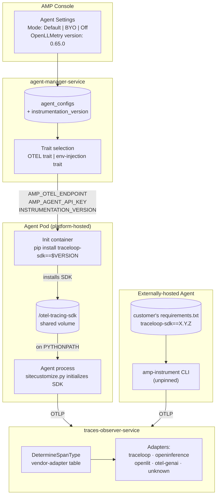
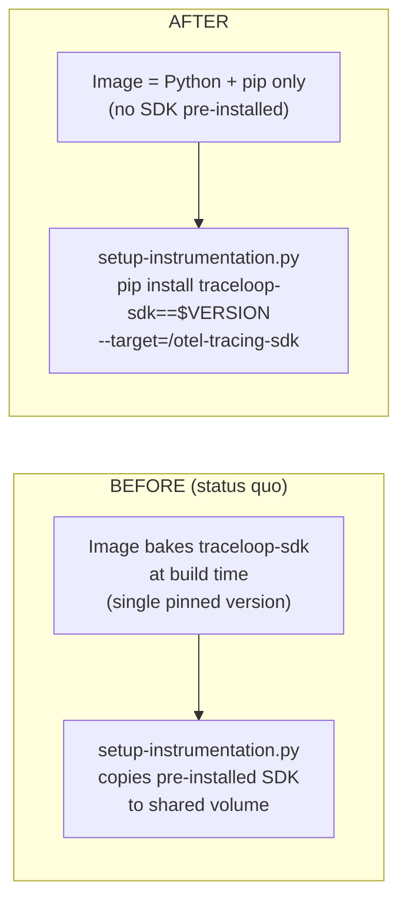
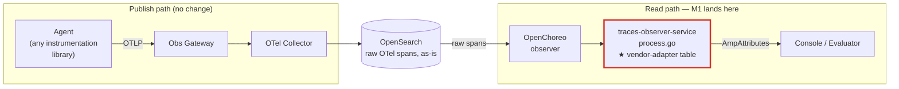
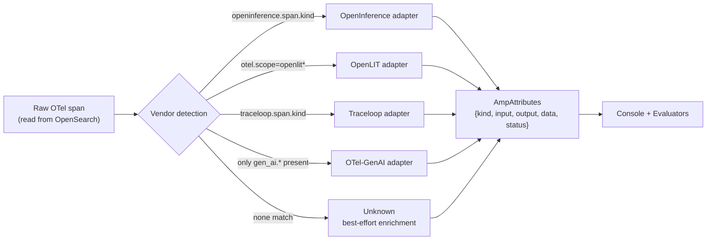
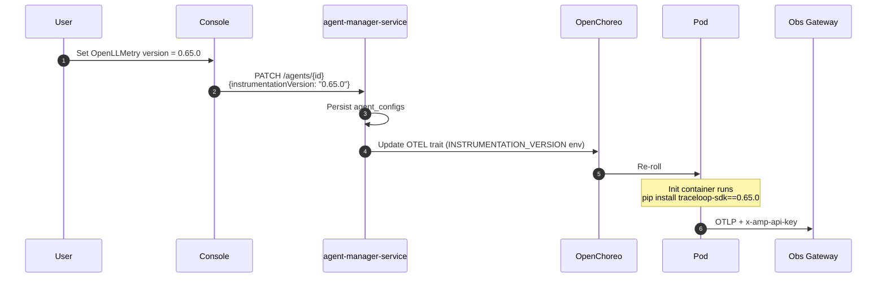
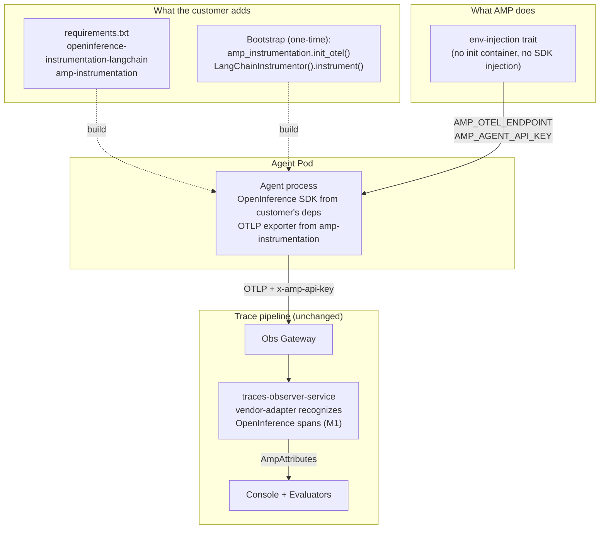

# [Design Proposal] Auto-Instrumentation Redesign

## Problem

We currently bundle one OpenLLMetry version (`traceloop-sdk>=0.47.0,<=0.60.0`) into a platform init container that gets injected into every Python agent. The customer can't pick a different version, and we own everyone's upgrade timing. That single decision is what's driving the recurring issues, and it shows up in four ways:

- **The customer's stack conflicts with our hardcoded version.** Their LangChain version pulls in a different `opentelemetry-semconv-ai`, and the Traceloop instrumentor blows up at agent startup. Example`cannot import name 'GenAICustomOperationName'`.
- **We can't bump our hardcoded version without moving everyone at once.** When we do want a newer Traceloop version, every agent must move together.
- **Customers using OpenInference or OpenLIT are second-class.** Their spans reach our gateway fine, but the observer doesn't recognize them, so they show up as `kind: unknown` in Console with no rich UI and no evaluator support.
- **There's no documented escape.** The only way out today is to disable auto-instrumentation entirely. We don't tell customers what to do after that.

This affects every Python agent customer on the platform. The vendor-lockout point is the loudest signal from prospects who've standardized on OpenInference/OpenLIT. The version-pin pain is the most frequent incident.

## User Stories

**Agent developer**

- I want to pick the OpenLLMetry version that's compatible with my framework versions, so my agent starts cleanly.
- I want to use whichever instrumentation library I prefer (OpenInference, OpenLIT, vanilla OTel) and still get rich traces and evaluators in Console.
- If I'm running externally, I want my own `requirements.txt` to be the source of truth for the SDK version(no hidden AMP pinned version that conflicts with mine).

**Platform administrator**

- When AMP raises the platform default version, existing agents should stay where they are. Surprise upgrades break running workloads.
- I'd rather have one deployment requirement (PyPI reachability) than a growing image build matrix to maintain.

## Existing Solutions

| Source | Approach | What we take from it(infor on this part will be more explained later)                                                                                                                                                                                                                                                                                                                                                                                    |
|---|---|----------------------------------------------------------------------------------------------------------------------------------------------------------------------------------------------------------------------------------------------------------------------------------------------------------------------------------------------------------------------------------------------------------------------------------------------------------|
| OpenLLMetry / Traceloop product | Customer-installed library; customer controls version | Traceloop's own product ships it as a library the customer pins themselves. Our pain comes from inverting that pinning the SDK for the customer at the platform layer. The direction we want is to stop owning the customer's version.                                                                                                                                                                                                                   |
| OpenInference / Arize Phoenix | Per-library packages; customer composes their own stack | There is no single OpenInference SDK; it's a family of per-library packages (`-langchain`, `-openai`, `-llama-index`, …). Shipping it as a managed mode means either bundling them all (heavy image), auto-detecting from the customer's stack (build-time complexity), or adding a sub-package selector in the UI (more clicks) which results in a lot of work. So this kind of improvement(managed OpenInference) can be addreesed in post-GA, not GA. |
| OpenLIT | One SDK with one `init()` call | Architecturally a near-clone of OpenLLMetry: a single SDK with a single `init()` call. Our runtime `pip install` mechanism generalizes to it with just a different package name and a one-line dispatcher entry, which makes it the natural second managed provider once OpenLLMetry is in(meaning we can support this kind of support for OpenLit after GA).                                                                                            |
| OTel auto-instrumentation operator | Init container does runtime install at pod startup; version configurable per-deployment | The established pattern from upstream OpenTelemetry for SDK-agnostic, version-configurable instrumentation. Confirms our runtime-install delivery model isn't novel and we're adopting a proven approach instead of inventing one.                                                                                                                                                                                                                       |

## Proposed Solution

### Overview

Three things, and they're loosely coupled enough to ship in order.

First, the observer learns to read spans from any reasonable instrumentation library. We add a small adapter table in `traces-observer-service/opensearch/process.go` for OpenInference, OpenLIT, and vanilla OTel-GenAI; unknown spans fall back to OTel-GenAI standard attributes so they at least render with input/output and token usage.

Second, the init container becomes a thin Python+pip image that runs `pip install traceloop-sdk==<version>` at pod startup. The customer picks the version in Console, we pass it through as an env var. One image, any version, no version matrix to maintain.

Third, BYO becomes a real option for customers who need something other than OpenLLMetry. They install whichever instrumentation library they want, we inject only the OTLP endpoint and API key, and a small helper package handles the OTLP wiring. For externally-hosted agents we drop the upper-bound on `traceloop-sdk` in `amp-instrumentation` so their `requirements.txt` wins.

That covers the version-pin pain, the forced-migration risk, and the vendor lockout for GA. Managed OpenLIT lands in Q3, managed OpenInference in Q4 if customers actually ask for it.

### Architecture (after redesign)



### Init container, before and after



The trade-off is pod cold start. Each new pod runs `pip install` once, which adds roughly 10–30 seconds depending on network and dependency resolution. Steady-state is unaffected. PyPI reachability becomes a documented deployment requirement; air-gapped customers point at a private mirror.

If our M4 measurements show cold start consistently above 30s, we keep a pre-built image for the platform-default version and only do the runtime install when the customer overrides. That's a simple fallback, not a different architecture.

### Where the schema-tolerant logic fits in the trace pipeline

The new vendor-adapter logic lives on the **read path**, not the publish path. The publish path stays exactly as it is today: the agent emits OTLP, the gateway tags it, the collector indexes raw OTel spans into OpenSearch untouched. The reshape into `AmpAttributes` happens later, at query time, inside `traces-observer-service`. That's the only place we change.



Nothing in the ingest pipeline changes; no collector config, no OpenSearch index changes, no gateway changes. We're only teaching the read-side enrichment to recognize more vendors.

### Vendor-adapter table (detail of `process.go`)



The `AmpAttributes` shape doesn't change. Console and evaluators consume it the same way regardless of which library produced the span.

### Per-agent config flow



### BYO instrumentation mode

When the customer needs an instrumentation library AMP doesn't manage today (anything other than OpenLLMetry), they switch the agent to **BYO** in Console. AMP stops injecting an SDK and only sets the two env vars; the customer brings the library and initializes it in their own code. The example below uses OpenInference for LangChain.



A quick note on packaging. We add the BYO helper to the existing `amp-instrumentation` package rather than publishing a separate one; restructured so the helper is the **base import** and the `amp-instrument` CLI sits behind a `[cli]` extra. That way BYO customers get a lean install with `pip install amp-instrumentation`; managed-Traceloop externally-hosted customers add `[cli]` to get the CLI wrapper. One package to publish, version, and document.

The helper itself does just one thing: it wires OpenTelemetry's OTLP exporter to AMP's gateway with the right endpoint and `x-amp-api-key` header. No instrumentation of its own, just the ~10 lines of OTel SDK boilerplate so the customer can focus on choosing and activating their preferred instrumentation library. It's used only in BYO mode - managed Traceloop (and managed OpenLIT later) handle their own OTLP wiring through `Traceloop.init` / `openlit.init` and don't touch it.

**What the customer writes** (one-time, in their bootstrap or `__init__.py`):

```python
# 1. Configure the OTLP exporter to point at AMP, with the agent's API key as a header
from amp_instrumentation import init_otel
init_otel()  # reads AMP_OTEL_ENDPOINT and AMP_AGENT_API_KEY from env

# 2. Activate whichever instrumentations the agent needs
from openinference.instrumentation.langchain import LangChainInstrumentor
LangChainInstrumentor().instrument()
```

That's the whole customer surface. Without the helper, it's roughly 10 lines of vanilla OpenTelemetry SDK setup (TracerProvider, BatchSpanProcessor, OTLPSpanExporter); with the helper, two calls.

For **externally-hosted** agents the model is identical except the customer sets `AMP_OTEL_ENDPOINT` and `AMP_AGENT_API_KEY` themselves (as they do today) and runs `python my_agent.py` directly. The `amp-instrument` CLI isn't needed in BYO — the customer controls their own bootstrap.

Once spans reach the gateway, the M1 schema-tolerant observer recognizes the OpenInference attribute schema and produces the same `AmpAttributes` shape Console and evaluators expect. The customer gets UI and evaluator parity with managed OpenLLMetry users without us shipping a managed OpenInference image.

### API and data model

`agent_configs` gets one new column:

```sql
ALTER TABLE agent_configs
ADD COLUMN instrumentation_version VARCHAR(64) NULL;
-- NULL means use the platform default
```

Agent create/update grows one optional field:

```yaml
configurations:
  enableAutoInstrumentation: true
  instrumentationVersion: "0.65.0"   # optional
```

The OTEL instrumentation trait grows one parameter:

```yaml
parameters:
  - name: instrumentationVersion
    required: false
```

For externally-hosted, the only code change is dropping the upper bound:

```diff
- "traceloop-sdk>=0.47.0,<=0.60.0",
+ "traceloop-sdk>=0.47.0",
```

Console gets an "OpenLLMetry version" field on agent settings, pre-filled with the platform default so most customers don't have to think about it.

## Alternatives Considered

| Approach | Trade-offs | Why not |
|---|---|---|
| Status quo + observer-only | Smallest possible change | Doesn't fix the version pin — the reason this work exists |
| Pre-built image matrix (Traceloop × N versions × Python) | Predictable, fast pod start | Maintenance grows linearly and we'd be limiting customers to the versions we picked. Runtime `pip install` gets the same outcome with no matrix |
| Full multi-vendor managed at GA | Best UX, zero-code for any provider | OpenInference is per-library, not a single SDK; the design work doesn't fit the GA window |
| Fully decoupled / BYO-only (drop managed Traceloop entirely) | Clean architecture | Breaking change for existing customers; UX regression we can't justify |
| Build-time SDK injection (bake into agent's own image) | No pod cold-start cost; conflicts surface at build time | Needs OpenChoreo build-extension changes; doesn't help externally-hosted. Reserved as a post-GA option if cold-start turns out to be a real problem |

## Open Questions

1. Final shape of the BYO helper. Leaning toward bundling into the existing `amp-instrumentation` package (helper as the base import, `amp-instrument` CLI behind a `[cli]` extra) rather than publishing a separate `amp-otel-helper`. One package to maintain, lean dep tree for BYO users.

   Concretely, the proposed `pyproject.toml` restructure:

   ```toml
   dependencies = [
       "opentelemetry-sdk>=1.27",
       "opentelemetry-exporter-otlp-proto-http>=1.27",
       "httpx>=0.25.0",
   ]

   [project.optional-dependencies]
   cli = [
       "click",
       "traceloop-sdk>=0.47.0",
   ]

   [project.scripts]
   amp-instrument = "amp_instrumentation.cli.main:cli"
   ```

   So BYO customers run `pip install amp-instrumentation`; managed-Traceloop externally-hosted customers run `pip install amp-instrumentation[cli]`. The change moves `traceloop-sdk` out of the package's hard dependencies — needs sign-off because that's a restructure of an already-published package. Confirm before M3.
2. What's the acceptable pod cold-start ceiling with runtime `pip install`? If it's consistently above 30s in M4 measurements, we ship a pre-built default image and only `pip install` on override.
3. Do we make PyPI reachability an explicit deployment requirement, or also ship a private-mirror config for air-gapped customers?
4. When AMP raises the platform default version, what does Console show? Probably a non-blocking notice; existing agents stay on their pinned version.
5. OpenInference's `GUARDRAIL` and `EVALUATOR` span kinds — map them to `tool` for GA, or add new `AmpAttributes` kinds (Console UI work)?

## Milestones

| Phase                            | Scope | Target               |
|----------------------------------|---|----------------------|
| M1: Observer schema-tolerance    | Vendor-adapter table in `process.go`; OpenInference + OpenLIT + OTel-GenAI adapters; unknown-bucket enrichment; fixture tests | May 11 - May 22      |
| M2: OpenLLMetry version selector | DB migration; init container switches to runtime `pip install`; `agent-manager-service` plumbs `INSTRUMENTATION_VERSION`; Console UI; drop the upper-bound pin in `amp-instrumentation` | May 22 - Jun 8       |
| M3: BYO mode promoted            | Helper package or extras; Console toggle (Default / BYO / Off); BYO docs covering OpenInference, OpenLIT, vanilla OTel | Jun 8 - Jun 15       |
| M4: Hardening & GA               | Smoke deploys for default Traceloop, custom version, BYO OpenInference, BYO OpenLIT; cold-start measurement; release notes; compat-hint doc | Jun 15 - Jun 22 (GA) |

Post-GA:

| Phase                                                          | Scope | Target         |
|----------------------------------------------------------------|---|----------------|
| Q3: Managed OpenLIT (according to customer requirements)                                         | Second managed provider (one extra dispatcher entry); provider dropdown in Console; default-version migration UX | Jul - Sep 2026 |
| Q4: Managed OpenInference (according to customer requirements) | Sub-package selector or build-time auto-detection for OpenInference's per-library structure | Oct - Dec 2026 |
