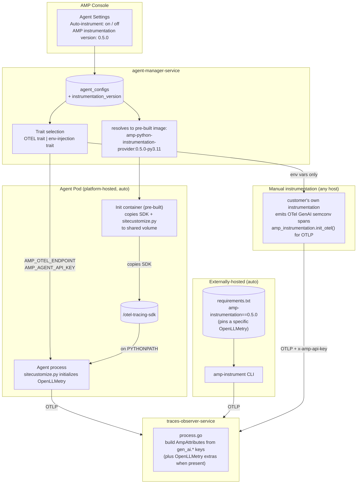
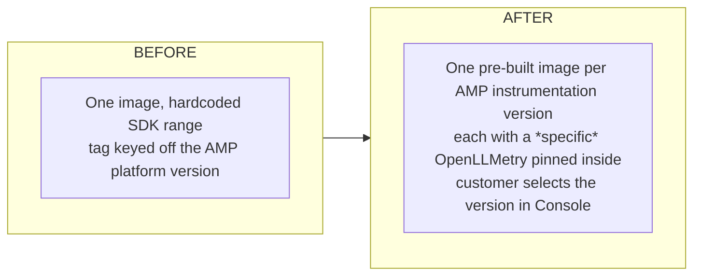
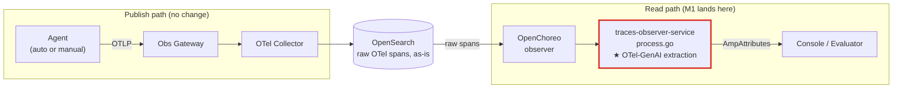
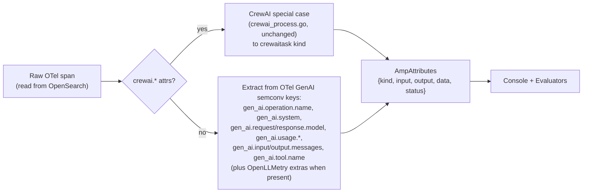
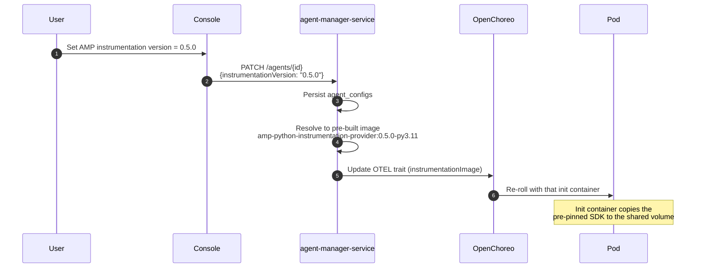

# [Design Proposal] Auto-Instrumentation Redesign

## Problem

We currently bundle one OpenLLMetry version (`traceloop-sdk>=0.47.0,<=0.60.0`) into a platform init container that gets injected into every Python agent. The customer can't pick a different version, and we own everyone's upgrade timing. That single decision is what's driving the recurring issues, and it shows up in four ways:

- **The customer's stack conflicts with our hardcoded version.** Their LangChain version pulls in a different `opentelemetry-semconv-ai`, and the Traceloop instrumentor blows up at agent startup. One such example was the `cannot import name 'GenAICustomOperationName'` error.
- **We can't bump our hardcoded version without moving everyone at once.** When we want a newer Traceloop version, every agent has to move together, so we don't bump it.
- **Customers who instrument differently are second-class.** If a customer disables our auto-instrumentation and emits their own spans, there's no documented contract for them to follow, so their spans land as `kind: unknown` in Console with no rich UI and no evaluator support.
- **There's no documented escape.** The only way out today is to disable auto-instrumentation entirely. We don't tell customers what to do after that.

This affects every Python agent customer on the platform. The version-pin pain is the most frequent incident; the lack of a manual path blocks customers running non-frontier or custom agent frameworks.

## User Stories

**Agent developer, the simple path (most users).** I'm not familiar with tracing or instrumentation internals. I have an agent and I want it instrumented with the shortest possible path. Ideally zero code changes. AMP should take care of it.

**Agent developer, the advanced user.** I know that a specific OpenLLMetry version works with my framework versions. I want to pin to that version so my agent starts cleanly and behaves predictably, instead of being moved whenever the platform default changes.

**Agent developer, custom / non-frontier framework.** My agent uses a framework that no off-the-shelf instrumentation library covers, so I write my own instrumentation. I need a clear contract from AMP (which endpoint, which header, which span attributes) so my traces render in Console and run through evaluators just like the auto-instrumented ones.

**Platform administrator.** When AMP raises the platform default instrumentation version, existing agents should stay on the version they were pinned to. Surprise upgrades break running workloads. I also want predictable, pre-verified deployment artifacts, not dependencies that get resolved fresh on every deployment.

## Existing Solutions

| Source | Approach | Relevance |
|---|---|---|
| OpenLLMetry / Traceloop product | Customer-installed library; customer pins the version | Pinning a vendor's SDK *for* the customer at the platform layer is the self-imposed constraint we're removing. AMP picks a default; the customer can change it. We keep OpenLLMetry as the managed library. |
| OpenTelemetry GenAI semantic conventions | A public, vendor-neutral spec for GenAI span attributes (`gen_ai.*`) | This is the contract for the manual path. It's a real standard (not ours to invent), the ecosystem is converging on it, and `process.go` already reads most of it. |
| OpenInference / OpenLIT | Off-the-shelf instrumentation libraries (OpenInference with its own attribute schema, OpenLIT roughly aligned with OTel GenAI) | Out of scope as platform-managed options. A customer can use them on the manual path *if* their spans conform to our contract (OpenLIT largely does; OpenInference would need a translation step). We don't special-case either. |

## Proposed Solution

### Overview

Three things, scoped to one milestone before GA:

**1. The observer renders any span that follows OTel GenAI semantic conventions.** `process.go` already extracts `AmpAttributes` from a mix of OTel-GenAI-standard keys and OpenLLMetry extensions. We complete the OTel-GenAI extraction path so a span carrying *only* `gen_ai.*` standard keys still yields a fully-populated `AmpAttributes`. That is what makes the manual-instrumentation contract enforceable. The CrewAI special case stays as-is. We do **not** add per-vendor adapters for OpenInference, OpenLIT, and the like; the contract is OTel GenAI semconv, and anything that conforms renders.

**2. Pre-built, version-pinned images; customer picks the version in Console.** We keep today's init-container pattern unchanged: pre-installed SDK plus `sitecustomize.py` copied into a shared volume. We do **not** run `pip install` at deployment time (more on why below). The change is that AMP maintains one pre-built image per **AMP instrumentation version**, each with a *specific* (not ranged) OpenLLMetry version pinned inside. The customer selects an AMP instrumentation version in the Console; AMP plumbs that to the right image. A new OpenLLMetry release means a new AMP instrumentation version and a new image; existing agents stay where they were.

**3. A documented manual-instrumentation contract.** For customers who can't or won't use our auto-instrumentation (typically because they run a custom or non-frontier agent framework), we publish the contract: the OTLP endpoint, the `x-amp-api-key` header, and the specific OTel GenAI semconv attributes a span must carry to render with full `AmpAttributes`. They satisfy it with any instrumentation library that emits conformant spans, or with code they write themselves. We ship a small helper in the `amp-instrumentation` package so they don't have to hand-write OpenTelemetry exporter boilerplate.

We provide OpenLLMetry as the platform-managed option and own that opinion. Whether a customer uses OpenInference, OpenLIT, or something else is out of scope; the manual contract is how they integrate. Adding a second *managed* library is a future decision that needs a functional justification (e.g. OpenLLMetry doesn't instrument a popular framework well) and its own proposal.

### Architecture (after redesign)



### Instrumentation delivery: what changes

Almost nothing in the mechanism changes. The init container still copies a pre-installed SDK and `sitecustomize.py` into a shared volume; `sitecustomize.py` still calls `Traceloop.init(...)`; the externally-hosted path still uses the `amp-instrument` CLI. We deliberately do **not** move to `pip install` at deployment time:

- `pip install` produces a *mutable* environment: indirect dependency versions can drift between two deployments of the same agent, because libraries declare ranges. That breaks the "same image, same result" guarantee.
- Enterprise customers operate under change management; they test, verify, and allowlist a fixed image. Resolving dependencies fresh at deployment time is a non-starter for them.

So the only delta is **versioning**:



The image tag moves from being keyed off the AMP product version to being keyed off the **AMP instrumentation version** (e.g. `amp-python-instrumentation-provider:0.5.0-py3.11`). `agent-manager-service` resolves the agent's configured version to that image when it attaches the OTEL trait. A new OpenLLMetry release means a new AMP instrumentation version and a new pre-built image; existing agents stay on whatever they were pinned to.

### Where the observer change lands

The observer change is on the **read path**, not the publish path. The publish path stays exactly as it is today: the agent emits OTLP, the gateway tags it, the collector indexes raw OTel spans into OpenSearch untouched. The reshape into `AmpAttributes` happens later, at query time, inside `traces-observer-service`. That is the only server-side change, and the publishing path is not touched.



No collector config changes, no OpenSearch index changes, no gateway changes. We're only completing the read-side extraction so it works from standard `gen_ai.*` keys alone.

### Building `AmpAttributes` (detail of `process.go`)

`process.go` decides each span's `AmpAttributes.kind` and pulls out its input/output/model/tokens. Two cases:



Today the second box leans on OpenLLMetry extensions (`traceloop.span.kind`, `traceloop.entity.input`/`output`) in several places. The M1 work is to **add OTel-GenAI-standard fallbacks everywhere those extensions are used**, so a span carrying only `gen_ai.*` keys still produces a complete `AmpAttributes`. The auto path is unchanged: OpenLLMetry spans carry both standard and extension keys, and the extensions just add detail. Spans matching neither path still appear in Console as plain spans (no rich UI), the same graceful degradation as today. The `AmpAttributes` shape itself doesn't change; Console and evaluators consume it identically.

### Per-agent config flow



### Manual instrumentation contract

When a customer turns off auto-instrumentation (typically because they run a custom or non-frontier agent framework), they instrument it themselves and emit spans against our published contract.

**Transport**
- POST OTLP/HTTP to `AMP_OTEL_ENDPOINT` (`/v1/traces`).
- Header: `x-amp-api-key: <AMP_AGENT_API_KEY>`. (For platform-hosted agents AMP injects both env vars via the existing env-injection trait; externally-hosted agents set them themselves, as they do today.)

**Span attributes.** The contract is an *enumerated* subset of the OpenTelemetry GenAI semantic conventions: every supported key is listed explicitly below (and in the guide), each linked to the OTel spec. Anything not on the list is ignored by the observer; a span missing a key listed as *required* still appears in Console, just without the corresponding part of the rich `AmpAttributes` view.

*Common to every GenAI span:*

| Key | Required | Feeds |
|---|---|---|
| `gen_ai.operation.name` (one of `chat`, `text_completion`, `embeddings`, `execute_tool`, `invoke_agent`, `create_agent`) | yes | `AmpAttributes.kind` |
| `gen_ai.system` (provider id, e.g. `openai`, `anthropic`, `aws.bedrock`, `azure.ai.openai`, `cohere`) | yes | vendor / framework |
| span status (OTel `Status`: `Ok` / `Error` plus message) | recommended | `AmpAttributes.status` |

*LLM spans (`gen_ai.operation.name` = `chat` or `text_completion`):*

| Key | Required | Feeds |
|---|---|---|
| `gen_ai.request.model` | yes | `LLMData.model` |
| `gen_ai.response.model` | no | `LLMData.model` (preferred over `request.model` when present) |
| `gen_ai.request.temperature` | no | `LLMData.temperature` |
| `gen_ai.usage.input_tokens` | no | `LLMData.tokenUsage.inputTokens` |
| `gen_ai.usage.output_tokens` | no | `LLMData.tokenUsage.outputTokens` |
| Messages (one of the two forms below) | yes (one form) | `AmpAttributes.input` / `AmpAttributes.output` |
| &nbsp;&nbsp;• structured: `gen_ai.input.messages`, `gen_ai.output.messages` (JSON arrays in the OTel GenAI message schema), `gen_ai.system_instructions` | | |
| &nbsp;&nbsp;• legacy indexed: `gen_ai.prompt.{i}.role`, `gen_ai.prompt.{i}.content`, `gen_ai.completion.{i}.role`, `gen_ai.completion.{i}.content` | | |
| Tool definitions for tool-calling LLM spans: `gen_ai.input.tools` (JSON), *or* legacy `gen_ai.request.functions.{i}.name`, `gen_ai.request.functions.{i}.description`, `gen_ai.request.functions.{i}.parameters` | no | `LLMData.tools` |

*Embedding spans (`gen_ai.operation.name` = `embeddings`):*

| Key | Required | Feeds |
|---|---|---|
| `gen_ai.request.model` | yes | `EmbeddingData.model` |
| `gen_ai.response.model` | no | `EmbeddingData.model` (preferred when present) |
| `gen_ai.usage.input_tokens` | no | `EmbeddingData.tokenUsage` |
| Input text: `gen_ai.prompt.{i}.content` (legacy indexed) | no | `AmpAttributes.input`. *OTel GenAI does not yet standardize embedding-input text; M1 locks the key and the guide documents it.* |

*Tool spans (`gen_ai.operation.name` = `execute_tool`):*

| Key | Required | Feeds |
|---|---|---|
| `gen_ai.tool.name` | yes | `ToolData.name` |
| `gen_ai.tool.description` | no | tool description |
| `gen_ai.tool.call.id` | no | tool call id |
| Tool arguments / result | no | `AmpAttributes.input` / `AmpAttributes.output`. *OTel GenAI coverage here is partial; M1 locks the keys (likely `gen_ai.tool.call.arguments` and a result attribute or span event) and the guide documents them.* |

*Agent spans (`gen_ai.operation.name` = `invoke_agent` or `create_agent`):*

| Key | Required | Feeds |
|---|---|---|
| `gen_ai.agent.name` | yes | `AgentData.name` |
| `gen_ai.agent.description` | no | agent description |
| `gen_ai.request.model` | no | `AgentData.model` |
| `gen_ai.system` | no | `AgentData.framework` |
| `gen_ai.system_instructions` | no | `AgentData.systemPrompt` |
| `gen_ai.conversation.id` | no | `AgentData.conversationId` |
| `gen_ai.usage.input_tokens`, `gen_ai.usage.output_tokens` | no | `AgentData.tokenUsage` |
| Messages (same forms as LLM spans: `gen_ai.input.messages` / `gen_ai.output.messages`, or the legacy indexed form) | no | `AmpAttributes.input` / `AmpAttributes.output` |

*Retriever / vector-DB spans* use the OTel **database** semconv, not GenAI:

| Key | Required | Feeds |
|---|---|---|
| `db.system.name` (e.g. `pinecone`, `chroma`, `qdrant`, `weaviate`, `milvus`, `pgvector`) | yes | `RetrieverData.vectorDB` |
| `db.collection.name` | no | collection |
| top-k | no | `RetrieverData.topK`. *The exact key (`db.vector.query.top_k` or its successor) is locked in M1 against the OTel DB-vector semconv and documented in the guide.* |

*Reranker spans.* OTel GenAI semconv does not yet standardize reranking. If a customer emits rerank spans, M1 decides what AMP reads (likely `gen_ai.operation.name` = `rerank` plus a model attribute) and the guide documents it. Until then, rerank spans render as plain spans.

*Optional, any span (evaluation correlation):* W3C baggage `task_id` and `trial_id`. Set these if the manual traces should be picked up by evaluation runs.

**What conformance buys:** spans that follow the contract render with full `AmpAttributes` and are usable by evaluators; spans that don't still appear, just without the rich UI.

A customer can satisfy the contract three ways: (a) an off-the-shelf library that already emits these keys (OpenLIT, the vanilla `opentelemetry-instrumentation-*` packages), (b) a library that doesn't, plus a translation step, or (c) hand-rolled instrumentation for a custom framework. AMP doesn't endorse or test any particular library on the manual path; the enumerated contract above is the only thing we commit to. The **manual instrumentation guide** (an M1 deliverable) publishes this list as the canonical, versioned "supported attributes" reference; this proposal's table is the working spec it's derived from.

We ship a small helper in `amp-instrumentation` so the customer doesn't have to hand-write the OpenTelemetry exporter setup:

```python
import json
from opentelemetry import trace
from amp_instrumentation import init_otel

init_otel()   # configures the OTLP exporter; reads AMP_OTEL_ENDPOINT and AMP_AGENT_API_KEY from env
tracer = trace.get_tracer("my-custom-framework")

# Emit an OTel GenAI semconv span for an LLM call:
with tracer.start_as_current_span("chat") as span:
    span.set_attribute("gen_ai.operation.name", "chat")
    span.set_attribute("gen_ai.system", "openai")
    span.set_attribute("gen_ai.request.model", "gpt-4o-mini")
    span.set_attribute("gen_ai.request.temperature", 0.7)
    span.set_attribute("gen_ai.input.messages", json.dumps(input_messages))
    response = call_model(...)
    span.set_attribute("gen_ai.response.model", response.model)
    span.set_attribute("gen_ai.output.messages", json.dumps(response.messages))
    span.set_attribute("gen_ai.usage.input_tokens", response.usage.input_tokens)
    span.set_attribute("gen_ai.usage.output_tokens", response.usage.output_tokens)
```

Without the helper, `init_otel()` is roughly ten lines of vanilla OpenTelemetry SDK boilerplate (TracerProvider, BatchSpanProcessor, OTLPSpanExporter). The manual path works for both platform-hosted and externally-hosted agents; the only difference is who sets the two env vars.

### API and data model

`agent_configs` gets one new column, the **AMP instrumentation version** the customer selected (not a raw OpenLLMetry version):

```sql
ALTER TABLE agent_configs
ADD COLUMN instrumentation_version VARCHAR(64) NULL;
-- NULL means "use the platform default"
```

Agent create/update grows one optional field:

```yaml
configurations:
  enableAutoInstrumentation: true
  instrumentationVersion: "0.5.0"   # AMP instrumentation version; optional
```

`agent-manager-service` resolves `instrumentationVersion` to the pre-built image tag and passes it to the OTEL trait, which already takes an `instrumentationImage` parameter.

For the externally-hosted path, `amp-instrumentation` pins a **specific** OpenLLMetry version instead of a range, so installing a given `amp-instrumentation` version gives a fully determined SDK:

```diff
- "traceloop-sdk>=0.47.0,<=0.60.0",
+ "traceloop-sdk==<pinned>",
```

A customer who needs a different OpenLLMetry version installs a different `amp-instrumentation` version. Console gets an "AMP instrumentation version" field on agent settings, pre-filled with the platform default so most customers never touch it.

### AMP instrumentation versioning

The intent: `amp-instrumentation` is AMP's thin layer over OpenLLMetry, with its own version number (independent of the AMP product version) that pins one specific OpenLLMetry version inside. The customer deals only with the AMP instrumentation version; AMP publishes a mapping from it to the pinned OpenLLMetry version.

The exact naming and versioning scheme is **not finalized**: whether the customer-facing identifier is an `amp-instrumentation` semver, a date stamp, or something else, and how it relates to the AMP release train, is still open (see Open Questions). The table below is **illustrative only**:

| AMP instrumentation version *(illustrative)* | OpenLLMetry (`traceloop-sdk`) pinned *(illustrative)* |
|---|---|
| 0.5.0 | 0.55.0 |
| 0.6.0 | 0.60.0 |

Whatever the scheme, the invariant is: when OpenLLMetry releases a version we want to support, we cut a new AMP instrumentation version, build a new pre-built init-container image for it, and add a row to the published mapping. Existing agents stay on their pinned version until the customer changes it.

### Trace content (prompt-pushing)

Prompt capture stays enabled by default. A customer who needs to suppress prompt/completion content sets the Traceloop-specific environment variable (`TRACELOOP_TRACE_CONTENT=false`); we document it. No new Console toggle for this milestone.

## Alternatives Considered

| Approach | Trade-offs | Why not |
|---|---|---|
| Recognize multiple vendor schemas in the observer (OpenInference, OpenLIT, and other adapters) | Renders those libraries' spans without the customer changing anything | Couples us to each vendor's evolving schema; OpenInference isn't close to OTel GenAI. We commit to OTel GenAI semconv as the manual contract instead and stay vendor-neutral. |
| Define an AMP-specific attribute namespace (`amp.*`) for the manual contract | Fully under our control, precise | Reinvention, exactly what the team ruled out. OTel GenAI semconv is a real standard; use it. |
| Runtime `pip install` of the SDK at pod startup | One base image, any version, no image catalog | Mutable, unpredictable deployments: indirect deps drift between deployments, and enterprises won't allowlist an environment resolved fresh each time. Rejected in design review. |
| Build images at AMP-installation time from a chosen set of versions | Avoids a long-lived image catalog | Maintenance pain, still a per-install matrix. Rejected. |
| Ship a second managed library (OpenInference / OpenLIT) at GA | Zero-code for those libraries | Not defensible on preference alone; OpenInference isn't even a single SDK. Any second managed library needs a functional justification and its own proposal. |
| Status quo plus observer extraction only | Smallest change | Doesn't fix the version pin, which is the reason this work exists. |

## Open Questions

1. **Lock the exact attribute set against the current OTel GenAI semconv during M1.** The spec is still experimental. The well-trodden parts (operation name, system, model, token usage, chat/text-completion messages, agent metadata) are enumerated in the contract above and are stable enough to commit to now. A few corners aren't standardized yet (embedding-input text, tool call arguments/result, retriever top-k, reranking) and are flagged in the table as "M1 locks the key." M1 picks the concrete keys for those (using the OTel keys where they exist), and the manual instrumentation guide freezes the full list. The observer also accepts both the structured (`gen_ai.input.messages`) and legacy indexed (`gen_ai.prompt.{i}.*`) message forms; the guide documents both.
2. **AMP instrumentation versioning scheme and cadence, not yet decided.** Open: what the customer-facing identifier is (an `amp-instrumentation` semver, a date stamp, something tied to the AMP release number), how it relates to the AMP release train, and whether we cut a new version for every OpenLLMetry release or only validated ones. The mapping table in the proposal is illustrative until this lands.
3. **Image-catalog scope.** How many `(AMP instrumentation version × Python version)` images do we keep pullable, and for how long? Agents pinned to old versions need their images to stay available.
4. **Enterprise reachability.** Which registry hosts the pre-built images, and what do customers need to allowlist?
5. **Default-version bumps.** Console shows a non-blocking "newer version available" hint; existing agents stay pinned. Confirm we never auto-upgrade.
6. **`amp-instrumentation` packaging.** The `amp-instrument` CLI is mandatory for the externally-hosted auto path and installs by default. Whether to also offer a lean install variant for the manual path is open; the existing external-agent setup instructions must not get more complex.

## Milestones

This proposal covers a single milestone before GA. Further iterations (e.g. evaluating a second managed instrumentation library, per-agent migration UX) get their own proposals.

**M1: instrumentation versioning + OTel-GenAI-complete observer + documented paths.**

| Workstream | Scope |
|---|---|
| Observer | In `traces-observer-service/opensearch/process.go`, add OTel-GenAI-standard fallbacks everywhere the extraction currently depends on OpenLLMetry extensions, so a span carrying only `gen_ai.*` keys yields a complete `AmpAttributes`; CrewAI special case unchanged; fixture-based tests for hand-rolled OTel-GenAI spans. |
| Versioning (platform-hosted) | `agent_configs.instrumentation_version`; resolve to a pre-built image tag; OTEL trait fed the resolved image; Console "AMP instrumentation version" field; one pre-built image per AMP instrumentation version. |
| Versioning (externally-hosted) | Pin `traceloop-sdk` to a specific version in `amp-instrumentation`; publish the version-mapping table; keep the `amp-instrument` CLI. |
| Manual path | Publish the contract (endpoint, `x-amp-api-key` header, the OTel-GenAI attribute profile above); ship the `init_otel` helper in `amp-instrumentation`; document both paths and the `TRACELOOP_TRACE_CONTENT` env var. |

**Release plan.** Releases run roughly weekly: 14 (this week), 15, 16, 17, 18. Release 18 lands ~mid-June and is the GA target for M1, with a code freeze ~mid-June. The init-container delivery plumbing (image copy, `sitecustomize.py`, env injection) already exists; M1 changes the version it points at, adds the Console selector, completes the observer extraction, and publishes the contract.
